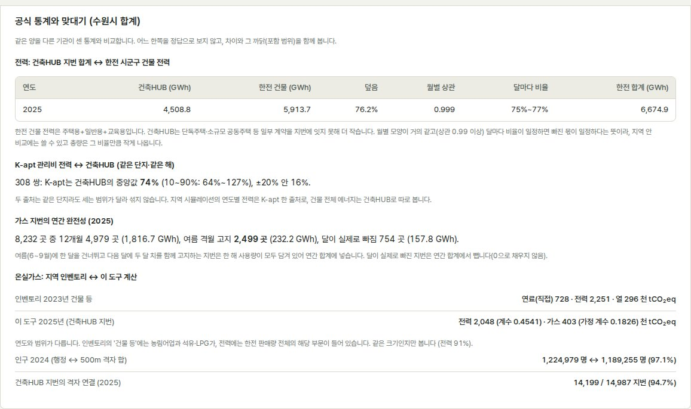

# 정확도·신뢰도 평가 (2026-09-30)

이 문서의 숫자는 모두 2026-09-30 사용자 PC의 Docker DB(`carbon-urban-dss`)에서 SQL, `/api/validation`, `/api/areas/analyze`, `validate-models`로 직접 센 **실데이터 값**입니다. 단위 테스트(가짜 입력)의 결과는 규칙이 코드대로 동작하는지만 보여 주므로 여기 근거로 쓰지 않았습니다. 화면의 **모델 → 공식 통계와 맞대기** 패널이 같은 비교를 현재 DB로 다시 계산합니다.

발표 자료: [Carbon-Urban-DSS-presentation.pptx](presentation/Carbon-Urban-DSS-presentation.pptx) ([PDF](presentation/Carbon-Urban-DSS-presentation.pdf)) — 이 문서의 내용을 17장으로 정리하고 슬라이드마다 발표 원고를 붙였습니다.

## 1. 한 줄 결론

| 쓰임 | 판단 | 근거 (아래 절) |
|---|---|---|
| 격자·동끼리 **상대 비교** (어디가 많이 쓰나, 우선순위) | **사용 가능** | 건축HUB 월별 합계가 한전 건물 전력과 상관 0.996~0.999, 빠진 몫이 달마다 일정(0.75~0.81) → 3절 |
| 시 전체 **절대 총량** (전력 kWh, 탄소 t) | **보정해서 참고** | 건축HUB는 한전 건물 전력(주택+일반+교육)의 **76~79%** 만 담음. 온실가스 인벤토리 대비 전력 탄소 0.85~0.91(전주·수원) → 3·4절 |
| 공동주택 **개발 전후 비교** | **같은 단지 기준으로 사용 가능, 기간 제한** | K-apt 전력만 한 출처로, 같은 단지끼리 비교. 과거 자료는 2022년부터(2015~2021은 수집 대기) → 5절 |
| **신축 계획의 에너지 추정** (원단위 × 연면적) | **격자 합계 수준 참고용** | 공간 블록 교차검증 nMAE 전력 9~15%, 가스 11~40%. 단지 하나의 예측에는 부족(전력 원단위 R² 0.2~0.5) → 6절 |
| **가스 탄소** | **가정값** | 건축HUB 가스 kWh의 발열량 기준이 공개되지 않아 가정 계수 사용(순발열량이면 약 11% 큼) → 7절 |
| **전국 시·군·구 지도** (한전·GIR·SGIS) | **사용 가능** | 공식 통계를 가공 없이 표시. 한전 전력으로 역산한 GIR 전력 계수(2023년 0.397)가 공표 소비단 계수 0.3996과 일치 → 4절 |
| 농촌형 군 지역(완주 등) 총량 | **주의** | 단독주택이 건축HUB에서 빠져 인벤토리 대비 전력 0.56 → 4절 |

## 2. 자료별 신뢰도

| 자료 | 범위 | 무엇이 믿을 만한가 | 약점 | 판단 |
|---|---|---|---|---|
| **건축HUB 건물에너지** (국토부, 법정동×월 전 지번) | 2024-01~ (2015~2023은 제공기관에 없음). 전주·완주 2024·2025, 수원 2025 | 계량기 값. 월별 모양이 한전과 거의 같음 | 단독주택·200세대 미만 공동주택·산업용 제외 → 한전 건물 전력의 76~79%. 수원 가스는 여름 격월 고지(8절) | **높음 (부분 표본)** |
| **K-apt 관리비 에너지** (공동주택관리정보시스템, 단지×월) | 전주 2023~2025 전 단지, 2022 일부(249/364단지), 2015~2021 수집 대기. 수원 2025 | 과거까지 있는 유일한 단지 자료 | 미보고 달 8~23%. 같은 단지·같은 해 건축HUB의 **중앙값 77%** 이고 ±20% 안은 16~28%뿐 → 출처를 섞으면 안 됨 | **중간 (연도 비교는 이 출처만으로)** |
| **한전 시군구 계약종별 전력** | 전국, 2015~2025 연간 + 2026년 1~7월 | 공식 판매량 | 시군구 단위. 격자로 나누지 않음 | **높음 (기준값)** |
| **GIR 지역 온실가스 인벤토리** | 시·군·구 229곳, 2010~2023 | 국가 공식 산정. 한전 판매량으로 역산한 전력 계수가 공표 계수와 일치 | '건물 등'에 농림어업·석유·LPG 포함. 2년 늦게 공표 | **높음 (범위 차이 주의)** |
| **도시가스 시·도 판매량** (한국가스공사) | 1989~2024 | 공식 판매량 | 시·도 단위, ㎥ | **높음 (시·도 요약용)** |
| **국가 전력 배출계수** | 2018·2021·2024 승인 회차 | GIR 공표 원문 확인(2019·2022·2025년부터 적용) | 2015~2018년은 계수 없음 → 그 해 탄소는 비움 | **높음** |
| **가스 배출계수** | IPCC 2006 천연가스 기본계수 | 국제 기본값 | 건축HUB kWh의 총/순발열량 기준 미공개 | **가정값** |
| **SGIS 행정동 인구·가구** | 2015~2024 (2025 미공표) | 공식 통계 | 행정동 단위 | **높음** |
| **SGIS 500m 격자 통계** (자료제공 신청분) | 2000~2024 | 공식 격자 | 경계 칸이 여러 시군구에 걸침 → 9절에서 고침 | **높음 (보정 후)** |
| **기상** | 전주 ASOS 132개월(2015~2025), 다른 지역 ERA5-Land | ASOS는 관측 | ERA5-Land는 재분석(격자 관측 아님) | **높음 / 중간** |
| **건축물대장·VWorld 건물·용도지역·연속지적** | 조회 시점 | 공식 대장·도형 | 면적 오기 일부(정제 규칙으로 걸러냄). 지번→격자 연결 전주 96.7%, 수원 94.7%, 완주 95.5% | **높음** |

## 3. 교차 검증 1: 건축HUB ↔ 한전 (전력)

같은 시·군·구의 같은 달을 두 기관이 센 값입니다. 한전 건물 전력 = 주택용 + 일반용 + 교육용.

| 지역·연도 | 건축HUB / 한전 건물 | 월별 상관 | 달마다 비율 범위 |
|---|---:|---:|---|
| 전주 2024 | 77.6% | 0.996~0.999 | 약 0.75~0.81 |
| 전주 2025 | 79.0% | 〃 | 〃 |
| 수원 2025 | 76.2% | 〃 | 〃 |
| 완주 2025 | 78.0% | 〃 | 〃 |

해석: 빠진 부분(단독주택·소규모 공동주택)이 **해마다·달마다 거의 같은 비율**입니다. 그래서 지역 **안**의 비교와 연도 변화에는 그대로 쓸 수 있고, 총량은 약 1/0.77배로 커질 수 있다고 읽어야 합니다. 화면의 전력 지표 설명에 이 비율을 적었습니다.

K-apt ↔ 건축HUB (같은 단지·같은 해, 12개월 모두 있는 쌍): 전주 494쌍 중앙값 78.3%, 수원 308쌍 74.3%, 합계 803쌍 76.9%. K-apt 관리비 전력은 세대 전기를 일부만 담는 단지가 많아 **두 출처를 한 시계열에 섞으면 2024년에 사용량이 30% 가까이 뛴 것처럼 보입니다**. 그래서 5절처럼 고쳤습니다.

## 4. 교차 검증 2: 온실가스 인벤토리 ↔ 이 도구

**인벤토리 자체의 일관성.** 229개 시·군·구의 인벤토리 전력 배출량 합 ÷ 한전 판매량 합 = 2015년 0.479, 2018년 0.508, 2022년 0.417, **2023년 0.397** kgCO₂eq/kWh. 2023년 값은 공표 소비단 계수 0.3996과 같습니다. 인벤토리와 한전 자료를 함께 믿어도 된다는 뜻입니다.

**이 도구 2025년 계산 ↔ 인벤토리 2023년 '건물 등'** (연도와 범위가 달라 같은 크기인지만 봅니다)

| 지역 | 전력 탄소 (이 도구 / 인벤토리) | 가스 탄소(가정 계수) / 인벤토리 연료 직접배출 |
|---|---:|---:|
| 전주 | 990.8 / 1,160.7천t = **0.85** | 350.1 / 566.1 = 0.62 |
| 수원 | 2,047.5 / 2,251.4천t = **0.91** | 403.0 / 727.8 = 0.55 |
| 완주 | 164.4 / 294.4천t = **0.56** | 43.0 / 95.5 = 0.45 |

- 전주·수원 전력은 3절의 덮음 비율(76~79%)과 계수 차이를 생각하면 맞는 크기입니다.
- 가스가 절반 남짓인 까닭: 인벤토리의 '건물 등' 연료에는 석유·LPG·농림어업이 들어 있고, 건축HUB 가스에는 단독주택이 빠져 있습니다.
- **수원 지역난방 열(인벤토리 296천t, 총배출의 8%)은 이 도구에 없습니다.** 지역난방 단지가 많은 곳은 가스만으로 난방 탄소를 볼 수 없습니다.
- 완주는 단독주택과 농업 전력 비중이 커서 건축HUB로는 절반 남짓만 보입니다. 농촌형 군의 총량은 한전·인벤토리 지표(전국 지도)를 쓰는 편이 맞습니다.

## 5. 지역 시뮬레이션(개발 전후)의 신뢰도

- **전력 시계열은 K-apt 한 출처**(2015~), **가스는 건축HUB**(2024~)로만 셉니다. 연도마다 출처가 바뀌어 생기는 가짜 증가를 없앴습니다.
- **같은 단지끼리 비교**: 전주 반경 4km, 2023년 준공 사건 기준(전 2021~2022, 후 2024~2025)
  - 전체 합계: 216.9 → 338.9GWh, **+56.3%**
  - 두 기간 모두 보고한 기존 103개 단지: 199.2 → 208.7GWh, **+4.8%**
  - 합계 증가의 대부분은 K-apt에 보고하는 단지가 늘어난 것(2022년 115곳 → 2025년 173곳)이지 사용량 증가가 아닙니다. 화면은 두 값을 함께 보이고 같은 단지 수를 적습니다.
- 한계: K-apt 과거 수집이 공공데이터 하루 한도(5,000건)에 걸려 **2015~2021년이 아직 없습니다**(2022년도 364단지 중 249곳). 매일 자동으로 이어 받으므로 시간이 지나면 전후 비교 기간이 늘어납니다. 미보고 달은 0으로 채우지 않고 그 단지·연도를 뺍니다(전주 미보고 비율 2023년 22.5%, 2024년 20.4%, 2025년 17.4%).

## 6. 모델 검증 (공간 블록 교차검증, 2025)

2km 공간 블록 GroupKFold. 검증 폴드는 학습에 쓰지 않은 블록입니다. nMAE = 평균 절대오차 ÷ 평균 관측값. "원단위 R²"는 연면적 크기 효과를 뺀, 격자 사이 kWh/m² 차이의 설명력입니다.

| 지역·에너지 | 격자·월 | 가장 좋은 모델 | nMAE | 원단위 R² | 기준(월별 평균 원단위) nMAE / 원단위 R² |
|---|---:|---|---:|---:|---|
| 전주 전력 | 1,656 | RandomForest | **9.4%** | 0.54 | 10.1% / 0.44 |
| 전주 가스 | 1,644 | RandomForest | **10.8%** | 0.92 | 19.1% / 0.86 |
| 수원 전력 | 2,448 | spline+Ridge | **14.8%** | 0.23 | 16.0% / 0.19 |
| 수원 가스 | 1,872 | RandomForest | **40.4%** | 0.88 | 55.3% / 0.80 |

- 가스는 난방방식(지역난방/개별난방)에 따라 원단위가 20배 넘게 다릅니다(수원 지역난방 단지 258곳 중앙값 3.0 vs 개별 188곳 71.8kWh/m²). 이것을 모델 특성(`지역난방 연면적 비율`)과 기준 모델 묶음에 넣은 뒤 수원 가스가 크게 나아졌습니다(9절).
- 수원 가스 오차가 여전히 큰 까닭: 지역난방 격자는 가스 사용량이 작아 같은 절대오차도 비율로 크게 보이고, 격자 안 난방방식이 섞여 있습니다. 수원 가스 추정은 **참고용**입니다.
- 전력은 모델이 기준보다 조금만 낫습니다. 거주 행태·가전처럼 자료에 없는 요인이 큽니다. 서비스의 시뮬레이션은 여전히 관측 원단위를 쓰고, ML 결과는 검증 참고로만 둡니다.

## 7. 탄소 계산의 불확실성

| 항목 | 현재 처리 | 불확실성 |
|---|---|---|
| 전력 계수 | 공표 회차별: 2019~2021년 0.4594, 2022~2024년 0.4781, 2025년~ 0.4541 kgCO₂eq/kWh | 공식값. 2015~2018년은 계수가 없어 탄소를 비움(0 아님) |
| 가스 계수 | IPCC 2006 천연가스 기본계수, 건축HUB kWh를 총발열량으로 가정 → 0.1826 kgCO₂eq/kWh | 순발열량 기준이면 약 +11%. 2025년 승인 전력 계수는 원문 미확인이라 등록하지 않음 |
| 지역난방 열 | 없음 | 수원처럼 지역난방이 많은 곳은 난방 탄소가 빠짐 |
| 대상 범위 | 건축HUB가 준 건물만 | 단독주택·소규모 공동주택 빠짐 (3절) |

## 8. 이번 점검에서 찾아 고친 것 (전 → 후, 실측)

| 문제 | 찾은 방법 | 고친 것 | 효과 |
|---|---|---|---|
| **500m 격자 인구를 첫 행정코드에 몰아 줌** (경계 칸은 여러 시군구 코드를 가짐) | 격자 인구 합 ÷ 행정 인구 | 경계 칸을 걸친 시군구에 똑같이 나눔 | 전국 지도: 행정 인구와 ±3% 안 51.5% → **73.3%**, ±10% 안 → **99%**, 범위 0.62~1.74 → **0.93~1.15** (전주 0.998, 수원 0.971, 완주 1.01) |
| **전력 시계열에 두 출처가 섞임** (K-apt + 2024년부터 건축HUB) | K-apt ↔ 건축HUB 같은 단지 비교(중앙값 77%) | 전력은 K-apt만, 가스는 건축HUB만 | 2024년의 가짜 증가(약 +30%) 제거 |
| **전후 비교가 보고 단지 수 변화를 사용량 변화로 읽음** | 연도별 보고 단지 수 | 두 기간 모두 보고한 기존 단지끼리 비교 | 전주 4km: 합계 +56.3% vs 같은 103단지 **+4.8%** |
| **가스 기준 모델이 난방방식을 무시** | 수원 가스 nMAE 169% | 지역난방 비율 특성, 난방방식별 기준 원단위 | 수원 가스 기준 nMAE 169% → **55%**, 최선 모델 127% → **40%** (총량 R² −0.35 → 0.85) |
| **수원 가스 지번 25%가 연간 합계에서 빠짐** (여름에 한 달씩 행이 없음) | 빠진 달 조합과 다음 달 크기 | 6~9월 중 한 달이 빠지고 다음 달이 있으면 한 해가 모두 담긴 것으로 셈 | 수원 가스 합계(격자에 연결된 지번) 1,739 → **1,963GWh (+12.8%)**, 반영 지번 4,880 → 7,265. 전주 +0.1% |
| **2019~2024년에 전력 계수가 없음** | 탄소 빈칸 | GIR 공표 회차별 계수 등록 | 2019년 이후 모든 해에 탄소 계산 |
| **비교할 기준이 화면에 없음** | — | 모델 화면에 '공식 통계와 맞대기' 패널 | 한전·인벤토리·인구·격자 연결을 현재 DB로 계산 |

**여름 가스 결측의 근거 (수원 2025, 건축HUB).** 가스 지번 8,232곳 중 2,009곳이 정확히 {7·9월} 또는 {6·8월}만 빠져 있습니다(두 무리가 1,103곳·906곳으로 반반). 9월이 빠진 무리의 10월 ÷ 5월 = 1.05, 9월이 있는 무리는 0.36으로 **2.9배** 차이가 납니다. 빠진 달의 사용량이 다음 달에 합쳐 고지된 것입니다. 수원 공급사 삼천리가 '난방용 하절기 격월고지 시행 안내'를 공지한 것과 맞는 모양입니다(공지 본문은 사이트 접속 제한으로 확인하지 못했고, 판단은 위 자료 모양에 근거함). 전주는 이런 지번이 116곳뿐입니다. 원자료에 0이 따로 오는 경우는 2행뿐이라, 빠진 달을 0으로 보지 않았습니다. 월별 모델 학습에는 이런 지번을 계속 넣지 않습니다(달별 값이 두 달 치라서).

## 9. 남은 한계와 다음 할 일

| 한계 | 영향 | 할 일 |
|---|---|---|
| K-apt 2015~2021 미수집 (하루 한도) | 전후 비교 기간이 2022년 이후로 짧음 | 자동 수집 유지. 운영계정(한도 상향) 신청 |
| 수원 K-apt 2025 실패 671행 | 수원 단지 일부 월 없음 | 자동 재시도 |
| 지역난방 열 미포함 | 수원 등 난방 탄소 과소 | 한국지역난방공사 지사별 열 판매량 확보 |
| 가스 발열량 기준 미공개 | 가스 탄소 ±11% | 건축HUB 활용가이드 환산 기준 확인 |
| 건축HUB의 단독주택 제외 | 총량 약 21~24% 작음, 농촌 군은 절반 | 총량은 한전·인벤토리 지표로 보고, 격자 분포만 건축HUB로 |
| 전력 원단위 설명력 낮음 (R² 0.2~0.5) | 단지 하나의 전력 예측 불확실 | 세대원 수·가전 등 행태 자료가 필요(현재 없음) |
| 500m 격자 인구 ±10% 밖 1% | 일부 시군구 격자 인구 오차 | 공식 대응표(격자-행정구역 면적비) 확보 시 교체 |

## 10. 다시 재는 방법

- 화면: **모델 → 공식 통계와 맞대기** (지역을 바꾸면 그 지역으로 다시 계산)
- API: `GET /api/validation?region=41110` (전력 덮음·월별 상관, K-apt↔건축HUB, 인벤토리, 인구, 격자 연결)
- 모델: `docker compose exec api python -m app.cli validate-models --year 2025 --region 41110`
- 가스 여름 결측 확인 SQL: 지번별 `array_agg(use_ym)`로 빠진 달 조합을 세고, 빠진 달 다음 달의 크기를 같은 무리 5월과 비교
