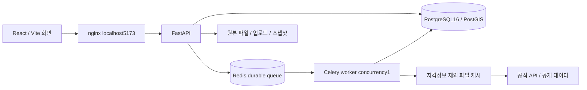

# 구성과 데이터 흐름

`models.py`는 DB 모델, `domain.py`는 단위·결측·시나리오 순수 계산, `collectors.py`는 공식 에너지·기상·지역·OSM 수집, `kapt.py`는 공동주택 공식 공개 목록과 좌표, `official.py`는 추가 승인 서비스 어댑터를 담당한다.

`imports.py`는 두 단계 업로드·좌표계 검증·기존/외부 격자 대응표를 저장한다. `quality.py`는 근거가 있는 품질 구성요소만 계산한다. `modeling.py`는 공간 교차검증과 결정론적 탐색, `model_service.py`는 실제 학습행 구성·검증 결과 저장을 담당한다.

모든 수치는 서버에서 계산하며 API키는 frontend에 전달하지 않는다. 로컬 `data/raw`, `data/cache`와 DB named volume을 함께 보존해야 오프라인 재현이 가능하다. DB 테이블은 프로토타입의 `create_all`로 생성한다. 운영 시스템으로 확장 시 정식 Alembic 버전 마이그레이션이 필요하다.

추가 모듈: scope.py는 모든 격자의 동일 관측 집합 분모를 검증한다. reporting.py는 decision_reports 테이블에 불변 근거 스냅샷을 저장하고 목록·조회·Markdown API를 제공한다. 선택형 local-ai 프로필의 Ollama는 내부 네트워크에서 근거 ID를 반환하며 API가 허용 ID와 원문을 검증한다. 프런트엔드 useAnalysisScope는 연도·격자를 공유하고 로컬 저장한다. 자세한 한계는 IMPLEMENTATION_UPDATE.md를 따른다.
