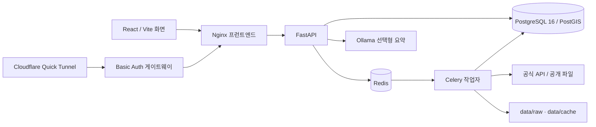

# Carbon Urban DSS — Claude 인수인계서

- 작성일: 2026-09-23 (Asia/Seoul)
- 저장소: https://github.com/shy0401/Carbon-Urban-DSS
- 작성 기준 커밋: `38c2244` (`main`)
- 목적: 새 담당자가 현재 구현·검증 범위와 미완료 조건을 구분하고, 근거를 보존하면서 다음 작업을 실행할 수 있게 한다.
- 바로 실행할 지시문: [CLAUDE_START_PROMPT_2026-09-23.md](CLAUDE_START_PROMPT_2026-09-23.md)

## 1. 프로젝트 목표와 성공 기준

전주시 주거 섹터를 대상으로 **2025년 월별 실제 에너지 사용량**, 기상·인구·건물·토지 정보를 500m 공간 분석에 연결하고 운영탄소와 계획 시나리오를 비교하는 의사결정 프로토타입이다. 내부 좌표계는 EPSG:5179, GeoJSON 응답은 EPSG:4326이다. 현행 500m 셀은 프로젝트가 만든 정렬 격자이며 SGIS/NGII 공식 격자가 아니다.

최종 실증은 단순히 화면이 실행되는 상태가 아니다. 공식 월별 에너지 관측과 출처·기간·단위·공간 매칭을 확보하고, 동일한 관측 범위에서 전기 및 검증 가능한 가스 운영탄소를 재현하며, 실제 자료로 모델 성능을 평가해야 한다. 현재 관측 `0행`은 사용량 0이 아니다. `OBSERVED`·`CALCULATED`·`ESTIMATED`·`FALLBACK`·`SCENARIO`와 결측·비공개·실제 0을 혼합하면 안 된다. 상세 요구사항은 [SRS.md](SRS.md), 계산 경계는 [CARBON_METHOD.md](CARBON_METHOD.md)를 따른다.

## 2. 먼저 알아야 할 현재 상태

| 항목 | 확인된 사실 | 시점·한계 |
|---|---|---|
| Git | `main`의 `38c2244`까지 GitHub에 반영. 작업 폴더의 `.idea/vcs.xml`은 사용자 개인 변경이므로 보존 | 2026-09-23 확인 |
| 자동 검증 | Python 91개, 프런트엔드 19개 통과. TypeScript/Vite 빌드 성공 | 2026-09-22 실행 |
| 공개 게이트웨이 | 보안 흐름 8개, 공개 화면·`/api/health`·`/api/readiness` HTTP 200 | 2026-09-22 실행. 주소의 영속성 보장 안 됨 |
| 로컬 Docker | 현재 Docker 엔진에 연결되지 않음. 재시작 후 서비스·DB 상태를 다시 확인해야 함 | 2026-09-23 확인 |
| 기록된 자료량 | 916개 분석 격자, 2,171개 OSM 건물, 364개 K-apt 단지, 유효 기상 월 22개, 월별 에너지 0행 | 2026-09-18 문서 스냅샷. **현재 DB를 재조회할 것** |
| 공공데이터포털 키 | K-apt 월별 에너지·KMA ASOS·건축HUB 에너지 실제 요청에서 HTTP 403 / 제공기관 오류 30 확인 | 2026-09-18 조사. 승인 키 적용 전 성공 수집 불가 |
| SGIS·VWorld | SGIS consumer key/secret, VWorld key/domain 부재. 어댑터와 모의 테스트는 있으나 실제 성공 응답 적재 미검증 | 2026-09-18 조사 |
| 로컬 AI | Docker Ollama `qwen2.5:1.5b`로 검증된 보고서 근거 선택과 한국어 서식 요약 | 모델은 계산·새 사실 생성에 사용하지 않음 |

위 자료량과 URL은 역사적 증거다. 시작할 때 `git status`, `docker compose ps`, `/api/readiness`, DB 행 수를 다시 읽고 문서와 다르면 **실제 상태를 기준으로** 갱신한다. 과거 테스트 성공을 오늘의 가동 상태로 표현하지 않는다. 수집 실패의 상세 증거는 [COLLECTION_FAILURE_AUDIT_2026-09-18.md](COLLECTION_FAILURE_AUDIT_2026-09-18.md), 이전 전체 목표 정리는 [FINAL_GOAL_ROADMAP_2026-09-18.md](FINAL_GOAL_ROADMAP_2026-09-18.md)에 있다.

## 3. 구조와 주요 파일



| 위치 | 책임 |
|---|---|
| `compose.yaml`, `compose.demo.yaml` | 기본 DB·Redis·API·작업자·웹과 선택형 Ollama·인증 게이트웨이·Quick Tunnel. DB/Redis/Ollama는 Docker named volume, 원본·캐시는 호스트 `data/`에 저장 |
| `backend/app/main.py`, `service.py` | FastAPI 경로와 대시보드·지도·시뮬레이션 서비스. 업로드와 보고서 라우터를 포함 |
| `backend/app/models.py`, `db.py` | 공통 데이터 모델과 세션. 추가 소스 테이블은 각 수집 모듈·`imports.py`·`reporting.py`에도 정의 |
| `backend/app/tasks.py`, `collection_preflight.py`, `cache.py` | Celery 수집 큐, 자격정보·최근 인증실패 사전 검사, 비밀값을 제외한 원본 캐시 |
| `backend/app/collectors.py`, `kapt*.py`, `kma_asos.py`, `sgis.py`, `vworld.py`, `official.py` | 공개 데이터 및 기관별 API 수집·정규화. VWorld 레이어는 `backend/config/vworld_layers.yaml`에서 설정 |
| `backend/app/imports.py`, `spatial.py`, `scope.py` | CSV/XLSX/GeoJSON/SHP ZIP 미리보기·가져오기, CRS/격자 매칭, 동일 관측 범위 검사 |
| `backend/app/emissions.py`, `domain.py`, `modeling.py`, `model_service.py`, `quality.py` | 계수·순수 계산·제약 탐색·모델 검증 자격 및 공간 교차검증·품질 상태 |
| `backend/app/reporting.py`, `readiness.py` | 근거 스냅샷 보고서·선택형 로컬 AI, 수집에서 활용까지의 현황 API |
| `frontend/src/App.tsx`, `pages/`, `components/`, `hooks/` | 대시보드, 지도, 분석, 모델, 시뮬레이션, 보고서, 수집 데이터와 연도·격자 공유 |
| `scripts/prototype.ps1`, `launch-prototype.ps1`, `start-prototype.cmd` | Windows에서 로컬 및 외부 시연 시작. `install-desktop-launcher.ps1`은 현재 PC 바탕화면 바로가기 생성 |

주요 API는 `/api/health`, `/api/readiness`, `/api/dashboard`, `/api/map`, `/api/grids/{id}`, `/api/sources`, `/api/collections`, `/api/scenarios`, `/api/optimize`, `/api/model`, `/api/uploads/*`, `/api/reports/*`다. DB 주요 테이블은 `data_sources`, `raw_data_assets`, `collection_jobs`, `grid_500m`, `energy_monthly`, `weather_monthly`, `apartment_complexes`, `apartment_energy_monthly`, `weather_daily_observations`, `sgis_population_admin`, `sgis_household_admin`, `vworld_zoning_areas`, `cadastral_parcels`, `scenarios`, `model_runs`, `decision_reports` 등이다. 현재 테이블 생성은 SQLAlchemy `create_all` 중심이라 버전 마이그레이션이 없다.

자료 흐름은 **수집 요청 → 사전 차단/허용 → 원본·출처 보존 → 단위·기간·결측 정규화 → PostGIS 격자 연결 → 탄소·모델·계획안 계산 → 지도·보고서 표시**다. 데이터 준비 화면은 `/api/readiness`의 각 출처 수량, 차단 이유와 활용처를 보여준다. 기존 DB 수량은 화면에서 직접 읽어야 한다.

## 4. 수집원별 실제 완성도

| 수집원 | 구현 상태 | 확보/차단 상태 | 다음 검증 |
|---|---|---|---|
| K-apt 단지 기본정보 | 목록·상세·좌표·격자 연결 | 과거 스냅샷 364단지 | 시점·연면적·중복과 대상 범위 재확인 |
| **K-apt 월별 에너지** | SMOKE 1단지×1개월 → LIMITED 3단지×12개월 → FULL, 성공 월 건너뛰기, 전기/가스/난방/급탕 단위 분리 | **실제 0행**, 키 오류 30 | 서비스별 활용 승인 키로 한 달 성공 응답과 원본·정규화·격자·전기 탄소 확인 |
| KMA ASOS 전주 146 | 일자료, 완전월 우선, ERA5-Land 대체 보존 | 공식 0행, 키 오류 30 | 2025년 일자료·월 완전성 검증 |
| ERA5-Land | 공개 API·원본·월 정규화 | 2025년 12개월 자료 확보 이력 | 재수집 없이 결측과 출처 확인 |
| 건축HUB 에너지·건축물대장 | 후보 지번 대상 어댑터 | 에너지 오류 30, 건축물대장 전수 미구현 | 각각 활용 승인 후 소규모 응답 검증, 전수·증분 설계 |
| SGIS 행정 인구·가구 | 토큰 TTL, 0/비공개/결측 분리 | 키 없음, 실제 0행 | 2020 등 제공 기준연도 인증·행정통계 적재 |
| SGIS 공식 500m 격자 | 일반 수동 업로드·격자 ID 매핑 기반 | 경계·통계 파일 없음 | 동일 기준연도 경계·ID·인구·비밀보호 플래그 확보 후 공간 대응 검증 |
| VWorld 용도지역·연속지적 | 설정 레이어, 2km² 이하 bbox, 페이지·geometry·CRS 검사 | key/domain 없음, 실제 0행 | 한 격자 bbox 성공 후 제한 범위·전체 확장 |
| 공식 계수 | 전기 0.4541 kgCO₂eq/kWh 근거 보존 | 가스 CO₂eq 적용 미확정 | 원자료 단위·발열량·GWP·연도 검토 |
| 선도소프트 100m 탄소격자 | 전용 어댑터 없음 | 원본·명세·이용조건 없음 | 제공기관 자료 확보 후 500m 독립 비교 설계 |

공공데이터포털 키 변수는 `DATA_GO_KR_SERVICE_KEY` 하나지만 K-apt 에너지 `15012964`, ASOS `15059093`, 건축HUB 에너지 `15135963`, 건축물대장 `15134735`는 **각 서비스의 활용 승인**이 필요하다. SGIS는 `SGIS_CONSUMER_KEY`/`SGIS_CONSUMER_SECRET`, VWorld는 `VWORLD_API_KEY`/`VWORLD_DOMAIN`이다. 설정 예시는 `.env.example`, 발급·수동 다운로드 방법은 [DATA_SETUP_GUIDE.md](DATA_SETUP_GUIDE.md)를 따른다. 인증정보를 코드·문서·Git에 복사하지 않는다.

## 5. 구현 우선순위와 완료 조건

| 순서 | 할 일 | Claude가 독립적으로 할 수 있는 일 | 외부 입력이 필요한 부분 / 완료 조건 |
|---:|---|---|---|
| P0 | **오늘의 상태와 자료 보존 확인** | Git·Docker·API·DB 상태 재조회, 원본과 볼륨 백업, 실패 작업·중복 출처 조사, 문서 숫자 갱신 | 백업을 실제 복원해 원본 수·핵심 DB 행 수 일치 확인. `down -v` 금지 |
| P1 | **팀원 PC 재현 운영** | 새 Windows PC 사전 검사·초기 설치, DB/승인 원본 안전한 내보내기·가져오기, 체크섬·복원 검증, 바탕화면 실행기와 안내 작성 | Git clone만으로 DB·`data/raw`·AI 모델은 복제되지 않는다. 비밀키·공개 주소는 묶음에서 제외. 깨끗한 환경 또는 별도 Compose 프로젝트에서 복원 E2E 통과 |
| P1 | **실제 월별 에너지 확보** | K-apt 호출·중복·단위·에러 경로 검토, 승인 키가 들어오면 SMOKE→LIMITED→FULL 수행, 사용량·공간 매칭과 전기 탄소 검증 | 계정 소유자의 서비스 활용 승인과 유효 키 필요. 실제 2025년 월별 관측 적재 및 출처·누락률 보고가 완료 조건 |
| P2 | KMA·SGIS·VWorld·건축물대장 | 각 소스의 작은 실제 응답부터 검증, 성공 시 범위 확대, geometry/CRS/비공개/페이지·중복 확인 | 승인 키, 공식 파일 또는 제공기관 접근. 모의 테스트만으로 완료 선언 금지 |
| P2 | 탄소·모델 실증 | 같은 관측 범위의 표본 구성, 공식 계수 검토, 공간·시간 누수 없는 검증, 지도·보고서 증거 연결 | 가스 기준·실관측·표본 부족 시 결과를 `자료 없음`으로 유지 |
| P3 | 운영 품질과 UI | 수집원 중복 표시(`zoning`/`vworld_zoning`, `population`/`sgis_grid`) 의미 정리, 초기 JS 번들 분할, 버전 DB 마이그레이션·개인 계정·자동 백업·모니터링 | 제품/운영 요구가 확정된 범위에서 테스트·문서·배포 확인 |

P1의 두 항목은 의존성이 다르다. 승인 키가 없으면 팀원 PC 이전·복원과 계측·UI 개선을 먼저 진행하고, 키가 제공되면 월별 에너지를 최우선으로 실증한다. 이용조건이 불명확한 외부 자료나 가스 계수는 임의로 채우지 않는다. 명시되지 않은 `FULL` 호출은 일일 한도·페이지 수를 확인한 뒤 실행한다. K-apt 364단지×12개월은 최대 약 4,368회라 제공 한도와 가깝다.

## 6. 실행·검증·인계 절차

Windows PowerShell에서 저장소 루트를 기준으로 실행한다. 새 PC에는 Git과 Docker Desktop의 Linux 엔진이 필요하다. `.env.example`을 `.env`로 복사하되 이미 있는 `.env`를 덮어쓰지 않는다.

```powershell
git status --short
if (-not (Test-Path .env)) { Copy-Item .env.example .env }
docker compose up -d --build
docker compose ps
Invoke-RestMethod http://127.0.0.1:8000/api/health
Invoke-RestMethod http://127.0.0.1:8000/api/readiness
docker compose exec -T api python -m pytest -q
Push-Location frontend
npm ci
npm test
npm run build
Pop-Location
```

`/api/readiness`의 `summary`, `pipeline`, 각 `sources[].blocker`, `collectable_now`가 수집 우선순위의 기준이다. 수집 전 `scripts/prototype.ps1 Start`는 Ollama와 공개 터널까지 시작하지만 실제 공개 URL은 매번 새로 확인해야 한다. `scripts/prototype.ps1 Status` 또는 로컬 `.secrets/prototype-access.md`가 현재 주소를 가리키는지 검증한다. `prototype / prototype`은 요청받은 **임시 시연 공용 계정**으로, 장기 운영의 개인별 인증이 아니다. 외부에서 민감 자료를 올리면 안 된다.

핵심 행 수를 비교할 때는 저장된 화면 캡처보다 DB를 직접 조회한다.

```powershell
docker compose exec -T postgres psql -U carbon -d carbon -Atc "SELECT 'grid_500m',count(*) FROM grid_500m UNION ALL SELECT 'apartment_complexes',count(*) FROM apartment_complexes UNION ALL SELECT 'energy_monthly',count(*) FROM energy_monthly UNION ALL SELECT 'apartment_energy_monthly',count(*) FROM apartment_energy_monthly UNION ALL SELECT 'weather_daily_observations',count(*) FROM weather_daily_observations UNION ALL SELECT 'sgis_population_admin',count(*) FROM sgis_population_admin UNION ALL SELECT 'vworld_zoning_areas',count(*) FROM vworld_zoning_areas;"
```

자료 이전 시 원본 `data/raw`, 업로드가 승인된 경우 `data/uploads`, PostGIS 덤프를 함께 보존한다. `.env`, `.secrets`, `data/cache`, `data/deployment`, Ollama 모델 볼륨은 기본 공유 묶음에서 제외한다. 모델은 새 PC에서 다시 받을 수 있다. 백업 파일은 `.gitignore` 대상 `data/backups/`에 두고 GitHub에 올리지 않는다. 실제 전송은 이용허가와 팀 내 안전한 전달 방법을 먼저 확인한다.

검증은 변경 범위에 맞는 테스트에서 시작해 백엔드 전체, 프런트엔드 테스트·빌드, API·브라우저 E2E, DB 행 수·원본 해시, 외부 터널의 인증·헬스 순으로 한다. [TESTING.md](TESTING.md), [DEPLOYMENT.md](DEPLOYMENT.md)의 명령을 참고한다. 브라우저 E2E는 Playwright 실행 환경이 있어야 하며, 테스트가 그 환경 때문에 실행되지 않았다면 통과했다고 기록하지 않는다.

## 7. 작업 규칙과 최종 인수 조건

1. 사용자의 기존 데이터·개인 변경을 보존한다. `docker compose down -v`, 무조건적 DB 재생성, `data/raw` 삭제, `git reset --hard`는 하지 않는다.
2. 비밀값·접근 토큰·사적 원본은 출력·커밋·공개 링크에 싣지 않는다. 새 키는 `.env`에만 적용하고 API·worker 컨테이너를 재생성한다.
3. 실제 API 성공, 모의 HTTP 테스트, 코드 구현, 데이터 적재, UI 표시를 각각 따로 검증한다. 빈 결과를 임의 관측값으로 대체하지 않는다.
4. 작은 수집 범위를 성공시킨 뒤 확대한다. 429/20/30 등 인증·한도 오류는 원인과 차단 상태를 기록한다.
5. 의미 있는 단계마다 테스트 근거와 함께 커밋하고 원격에 푸시한다. `.idea/vcs.xml` 같은 사용자 개인 변경은 포함하지 않는다. 강제 푸시는 하지 않는다.
6. 마칠 때 구현한 것, 실제 확보한 행 수, 테스트·배포 결과, 남은 외부 승인·자료, 다음 실행 명령을 이 문서와 운영 문서에 갱신한다.

**완료 판정:** 팀원 PC에서 저장소를 복제해 로컬 웹·API·DB를 시작하고 승인된 백업을 복원할 수 있으며, 월별 에너지 관측을 포함한 실자료의 출처·단위·기간·공간 매칭이 검증된다. 운영탄소·모델 정확도는 필요한 자료가 실제 확보된 범위에서만 표시한다. 외부 키나 제공기관 원본이 남아 있으면 그 의존성을 명시한 상태로 인계한다.
