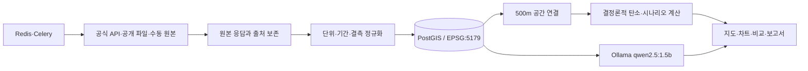

# Carbon Urban DSS 운영 준비 및 최종 Goal 달성 보고서

- 작성일: 2026-09-18
- 대상: 전주시 500m 주거 섹터 에너지·운영탄소 의사결정 지원 프로토타입
- 기준연도: 2025년
- 좌표계: EPSG:5179

## 1. 결과 요약

현재 시스템은 Docker Compose 한 묶음으로 PostGIS, Redis, FastAPI, Celery, React/Nginx, Ollama, 인증 gateway와 Cloudflare Quick Tunnel을 실행한다. 지도, 자료 수집, 시나리오, 탄소 계산, 모델 상태, 근거 기반 보고서가 연결되어 있다. 바탕화면의 `Carbon Urban DSS 서버 실행.cmd`를 실행하면 Docker Desktop을 시작하고 전체 서비스를 준비한 뒤 외부 HTTPS 주소를 검사하고 브라우저를 연다.

수집 데이터 화면에는 18개 출처의 상태, 원본·정규화 수량, 필요한 환경변수 이름, 첫 검증 범위, 차단 사유와 활용 분석을 표시한다. 데이터 흐름은 수집 18개 출처 → 원본 자산 18건 → 정규화 4,178행 → 500m 공간격자 916행 → 월별 에너지 관측 0행 → 지도·탄소·모델·보고서 4개 의사결정 기능으로 표시된다. 에너지 관측 `0행`은 소비량 0이 아니라 아직 유효한 관측을 확보하지 못했다는 뜻이다.

코드와 실행 구조는 준비됐지만 최종 실증의 핵심인 2025년 월별 에너지 관측은 아직 0행이다. 현재 공공데이터포털 키는 K-apt와 KMA 실제 호출에서 오류 30/20을 반환했다. SGIS와 VWorld 키는 설정되지 않았고 SGIS 공식 500m 파일은 직접 내려받아야 한다. 따라서 현 단계는 기능 프로토타입과 데이터 정직성·운영 구조는 완료됐으며, 실제 탄소 모델 검증은 외부 승인 데이터 확보 후 완료된다.

## 2. 구현된 운영 구조



Ollama는 Docker 내부 네트워크에서만 작동한다. 계산 엔진이 만든 수치를 변경하거나 새 사실을 생성하지 않고, 보고서에 이미 등록된 근거 ID를 선택해 한국어 요약을 구성한다. 모델 응답은 허용 ID와 원문 일치 검사를 통과해야 저장되며 실패하면 결정론적 기본 서식으로 대체된다.

## 3. 데이터 확보 상태와 활용

| 상태 | 데이터 | 현재 수량 | 활용 |
|---|---|---:|---|
| 수집 완료 | K-apt 공동주택 기본정보 | 364행 | 에너지 단지 매칭, 대상지 설명 |
| 수집 완료 | 전주시 공동주택 현황 | 609행 | 모집단·누락 비교 |
| 수집 완료 | ERA5-Land 기상 | 정규화 30행, 보존 유효월 22개 | KMA 결측 대체, HDD/CDD, 차트 |
| 수집 완료 | 법정동 코드 | 86행 | 공공 API 요청, 주소 정규화 |
| 수집 완료 | 프로젝트 500m 분석격자 | 916행 | 지도 집계, 공간 교차, 대상지 선택 |
| 부분 확보 | OSM 공동주택 건물 | 2,171행 | 지도 도형, 공식 건물과 비교 |
| 부분 확보 | 공식 배출계수 | 전기 1행 | 전기 운영탄소, 산식 근거 |
| 승인·키 수정 필요 | K-apt 월별 에너지 | 0행 | 운영탄소, 실데이터 모델 학습 |
| 승인·키 수정 필요 | KMA ASOS 전주 146 | 0행 | 공식 기상 우선순위, 기상 보정 |
| 키 필요 | SGIS 행정구역 인구·가구 | 각 0행 | 도시 현황, 수요 지표 |
| 직접 파일 필요 | SGIS 공식 500m 격자 | 0행 | 인구밀도, 공식 격자 교차검증 |
| 키·등록 도메인 필요 | VWorld 용도지역·연속지적 | 각 0행 | 토지이용 제약, PNU·지번 연결 |
| 승인·전수 수집 필요 | 건축HUB 에너지·건축물대장 | 각 0행 | 격자 에너지, 공식 면적·FAR/BCR |
| 기관 제공 필요 | 선도소프트 100m 탄소격자 | 0행 | 500m 결과의 독립 비교·검증 |

화면은 `수집 정보 → 실제 활용처`를 출처별 카드로 연결한다. 키 값은 표시하지 않고 환경변수 이름과 설정 여부만 표시한다. 행정구역 SGIS 통계를 500m 격자에 임의 배분하지 않으며, 단위와 배출계수가 검증되지 않은 가스·난방·급탕을 전체 탄소에 합산하지 않는다.

## 4. 실행·배포 상태

바탕화면의 `Carbon Urban DSS 서버 실행.cmd` 또는 저장소의 `scripts/start-prototype.cmd`를 실행한다. 실행기는 다음 작업을 자동으로 처리한다.

1. Docker 엔진이 꺼져 있으면 Docker Desktop을 시작하고 최대 3분간 기다린다.
2. DB, API, worker, 웹, Ollama를 빌드·시작한다.
3. `qwen2.5:1.5b`가 없으면 최초 한 번 내려받고 설치 상태를 검증한다.
4. 온라인 수집 모드, 인증 gateway와 Quick Tunnel을 시작한다.
5. 외부 HTTPS `/api/health`를 인증과 함께 검사한 뒤 브라우저를 연다.

시연 계정은 사용자 요청에 따라 `prototype / prototype`이다. Quick Tunnel 주소는 재시작 시 바뀔 수 있고 PC, Docker Desktop, 인터넷 연결이 유지되는 동안만 작동한다. 최초 실행 뒤 컨테이너는 `unless-stopped` 정책으로 Docker가 다시 켜질 때 자동 재시작한다. 고정 주소가 필요하면 관리형 Cloudflare Tunnel과 고정 도메인으로 전환해야 한다.

## 5. 검증 결과

| 검증 | 결과 |
|---|---|
| 백엔드 단위·GIS·PostGIS·외부 수집·캐시 | 81개 통과, 0개 실패 |
| React/Vitest | 11파일 19개 통과, 0개 실패 |
| TypeScript/Vite 운영 빌드 | 성공 |
| Chromium 사용자 흐름 | 10개 통과, page error 0개 |
| 공개 gateway 보안 흐름 | 8개 통과, 미인증·오인증·교차 출처 쓰기 차단 |
| 공개 HTTPS 사용자 흐름 | 10개 통과, page error 0개, 수집 작업 성공 |
| 데이터 준비 API | 18개 출처와 계보 응답 확인 |
| 로컬 LLM | `LOCAL_SLM`, qwen2.5:1.5b, 근거 원문 일치 검증 통과 |
| 외부 테스트 서버 | 인증된 HTTPS 상태 응답 `ok` 확인 |

## 6. 최종 Goal까지의 우선 작업

| 순서 | 작업 | 완료 조건 | 주체 |
|---:|---|---|---|
| 1 | 공공데이터포털 4개 서비스 활용 승인과 정상 키 적용 | K-apt 1단지×1개월, KMA 2025-01, 건축HUB 후보 지번 호출 성공 | 계정 보유자 + 개발 |
| 2 | K-apt 단계 수집 | SMOKE → 3단지×12개월 → 전주시 364단지×12개월, 성공 월 재호출 없음 | 개발 |
| 3 | SGIS·VWorld 인증 적용 | 행정통계와 한 격자 bbox 성공 후 제한·전체 범위 적재 | 계정 보유자 + 개발 |
| 4 | SGIS 공식 500m 원본 확보 | 경계, 격자 ID, 기준연도, 인구, 비밀보호 표식 통합 | 자료 신청자 + 개발 |
| 5 | 공식 건축물대장 전수화 | 페이지·증분 수집, PNU·건물·단지 공간 매칭률과 누락률 보고 | 개발 |
| 6 | 가스 탄소 방법 확정 | 원자료 단위, 순/총발열량, CO₂·CH₄·N₂O, GWP와 적용연도 검증 | 도메인 검토자 |
| 7 | 100m 탄소격자 통합 | CRS·단위·포함 부문·산정식·이용조건 확인 후 500m 독립 비교 | 제공기관 + 개발 |
| 8 | 실데이터 모델 검증 | 충분한 월·공간 표본, 누수 없는 검증, MAE/RMSE/R²와 표본수·한계 공개 | 개발·지도교수 검토 |
| 9 | 운영 배포 전환 | 고정 도메인, TLS, 사용자별 권한, 감사로그, 자동 백업·복구훈련, 모니터링 | 운영 담당 |

최종 Goal은 2025년 전주시 공식 월별 에너지와 공간·기상·인구·토지 자료가 출처와 함께 적재되고, 동일 기간의 실제 관측으로 운영탄소 및 모델 성능이 재현되며, 지도와 보고서가 결측·추정·법적 한계를 명확히 보여주는 상태다. 월별 에너지 확보 전에는 모델 성능과 탄소 감축률을 최종 성과로 제출하지 않는다.

## 7. 다음 작업 인계 프롬프트

```text
Carbon Urban DSS의 실데이터 완성을 이어서 진행해줘.

저장소: C:\Users\ggg\Documents\4학년\캡스톤\선도소프트
먼저 docs/FINAL_GOAL_ROADMAP_2026-09-18.md, docs/PROJECT_IMPLEMENTATION_STATUS.md, docs/DATA_SETUP_GUIDE.md를 읽어줘.
이번에 제공한 키 또는 파일: {{서비스명과 키/파일 설명}}

기존 PostGIS 볼륨과 data/raw를 삭제하지 말고 키 원문을 출력하거나 Git에 넣지 마. /api/readiness에서 해당 출처의 차단 상태를 확인한 뒤 SMOKE를 실제 실행하고, HTTP 상태·제공기관 코드·원본 저장·정규화 수량·단위·CRS·결측/비공개 처리를 검증해. SMOKE 성공 시에만 LIMITED, FULL 순서로 진행하고 성공한 월과 페이지는 재호출하지 마. 결과를 지도·분석·보고서에 연결한 후 백엔드 전체 테스트, 프런트엔드 테스트·빌드, Chromium E2E와 외부 HTTPS를 확인해. 실제 행 수와 남은 차단 사유를 문서에 갱신하고 의미 있는 단계마다 main 브랜치에 커밋·푸시해.
```
