# Carbon Urban DSS 사용 안내

전국 시·도에서 500m 격자까지, 공공데이터로 도시 에너지·탄소를 보고 계획안을 비교하는 도구의 사용법입니다. 화면 사진은 2026-09-29 PC에서 실제 DB로 찍었습니다.

- 발표 자료(22장, 발표자 메모 포함): [Carbon-Urban-DSS-guide.pptx](usage/Carbon-Urban-DSS-guide.pptx)
- 소개와 활용 자료(31장, 발표자 메모 포함: 작업 내역·데이터 범위·사용법·업종별 활용 예시 11가지): [Carbon-Urban-DSS-소개와-활용.pptx](presentation/Carbon-Urban-DSS-소개와-활용.pptx) · [PDF](presentation/Carbon-Urban-DSS-소개와-활용.pdf)
- 앱 안의 안내: 왼쪽 메뉴 **사용 방법**(`/guide`) — 지표 36개와 레이어 설명, 문제 해결까지 있습니다.
- 전국 자료 현황과 보충 자료: [NATIONWIDE_DATA.md](NATIONWIDE_DATA.md)

## 목차

1. [이 도구로 하는 일](#1-이-도구로-하는-일)
2. [시작하기](#2-시작하기)
3. [화면 구성](#3-화면-구성)
4. [지도 분석: 전국에서 500m 격자까지](#4-지도-분석-전국에서-500m-격자까지)
5. [지역 바꾸기](#5-지역-바꾸기)
6. [대시보드 · 분석](#6-대시보드--분석)
7. [지역 시뮬레이션](#7-지역-시뮬레이션)
8. [시뮬레이션](#8-시뮬레이션)
9. [모델 · 검토 보고서](#9-모델--검토-보고서)
10. [자료 수집 · 전국 지역](#10-자료-수집--전국-지역)
11. [값 읽는 법](#11-값-읽는-법)
12. [자료 현황과 보충 자료](#12-자료-현황과-보충-자료)
13. [문제 해결](#13-문제-해결)
14. [활용 예시](#14-활용-예시)

## 1. 이 도구로 하는 일

| | 하는 일 | 내용 |
|---|---|---|
| 보기 | 전국 어디든 지도로 비교 | 시·도와 시·군·구를 인구·주택·공동주택 지표로 비교하고, 시·군·구 안에서는 500m 격자와 읍면동으로 에너지·탄소·건물·용도지역을 봅니다. |
| 계산 | 계획과 목표를 숫자로 확인 | 층수·동수·세대로 계획안의 에너지·탄소를 계산하고, 구역의 개발 전후 변화와 목표 감축률에 필요한 효율 개선·재생에너지 양을 구합니다. |
| 기록 | 근거가 붙은 보고서 | 계획안 비교와 지역 검토를 한국어 보고서로 만들고 마크다운·PDF로 내려받습니다. |

지키는 원칙

1. **실측·계산·추정·시나리오를 나눕니다.** 값마다 근거 유형 배지가 붙습니다.
2. **없는 값은 0이 아닙니다.** 빗금과 "자료 없음"으로, 그 까닭과 함께 보여 줍니다.
3. **출처와 산식을 붙입니다.** 범례·상세·보고서에 같은 설명이 나옵니다.
4. **운영 단계 1차 추정입니다.** 법적 적합성이나 넷제로 달성을 판정하지 않습니다.

## 2. 시작하기

1. **Docker Desktop 켜기** — 첫 실행은 1~2분 걸립니다.
2. **서버 실행** — 바탕화면의 **Carbon Urban DSS 서버 실행**(또는 `scripts\start-prototype.cmd`)을 실행합니다. DB·API·수집 작업자·화면·로컬 AI·외부 접속 터널을 차례로 준비하고 브라우저를 엽니다.
3. **접속** — 같은 PC는 <http://localhost:5173>, 다른 기기는 런처가 만든 외부 주소와 비밀번호로 들어갑니다(주소는 `data/deployment/public-url.txt`).

> 외부 주소는 PC와 Docker가 켜져 있는 동안만 열리고, 런처를 다시 실행하면 바뀔 수 있습니다. 호출 한도가 있는 자료(K-apt·건축HUB)는 PC에서 계속 수집하며, 한도에 걸리면 다음 날 00:20에 스스로 이어 받습니다. 새 기능이 보이지 않으면 런처를 다시 실행하세요(새 코드로 다시 빌드합니다).

## 3. 화면 구성

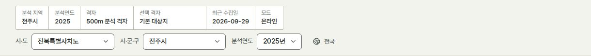

- **표제란**: 분석 지역 · 연도 · 격자 · 선택 격자 · 최근 수집일 · 모드
- **선택 상자**: 시·도 → 시·군·구 → 분석연도. 모든 화면에 함께 적용됩니다.

| 메뉴 | 하는 일 |
|---|---|
| 전국 지역 | 전국 시·군·구 개요와 지역 준비·상세 자료 수집 |
| 대시보드 | 선택 격자의 관측 에너지·전력 탄소·도시 형태 |
| **지도 분석** | 전국 → 시·도 → 시·군·구 → 읍면동 → 500m 격자 |
| 분석 | 난방도일과 월별 에너지, 행정동 인구, 용도지역 |
| 모델 | 에너지 모델의 공간 교차검증과 저장된 검증 |
| 지역 시뮬레이션 | 구역의 과거·현재, 개발 전후, 목표 감축 노력 |
| 시뮬레이션 | 계획안 계산, 최적안 탐색, 3D 배치·일조 |
| 수집 데이터 | 빠진 자료 전부 수집, 출처 상태, 파일 업로드 |
| 검토 보고서 | 계획안 최대 3개 비교 보고서, 내려받기·인쇄 |
| 사용 방법 | 화면별 사용법, 지표·레이어 설명, 문제 해결 |

## 4. 지도 분석: 전국에서 500m 격자까지

| 걸음 | 화면 | 보는 것 |
|---|---|---|
| 1 | 전국 | 시·도 16곳 비교. 지도나 메뉴에서 시·도를 고릅니다. |
| 2 | 시·도 | 그 시·도의 시·군·구가 같은 지표로 칠해집니다. |
| 3 | 시·도 500m 격자 | SGIS 500m 격자로 시·도 전체를 봅니다(제주 제외). |
| 4 | 시·군·구 지도 | 500m 분석 격자에 에너지·탄소·건물·용도지역 등 36개 지표 |
| 5 | 읍면동 | 격자 지표를 행정동으로 모으고 동끼리 비교 |

주소로 바로 열기

| 상태 | 주소 |
|---|---|
| 전국 | `/map` |
| 시·도를 고른 상태 | `/map?view=national&sido=52` |
| 시·군·구까지 고른 상태 | `/map?view=national&sido=52&sgg=52130` |
| 시·도 500m 격자 | `/map?view=province&sido=41` |
| 시·군·구 지도 | `/map?view=region` (머리에서 고른 지역) |

### 4.1 전국 — 시·도 고르기

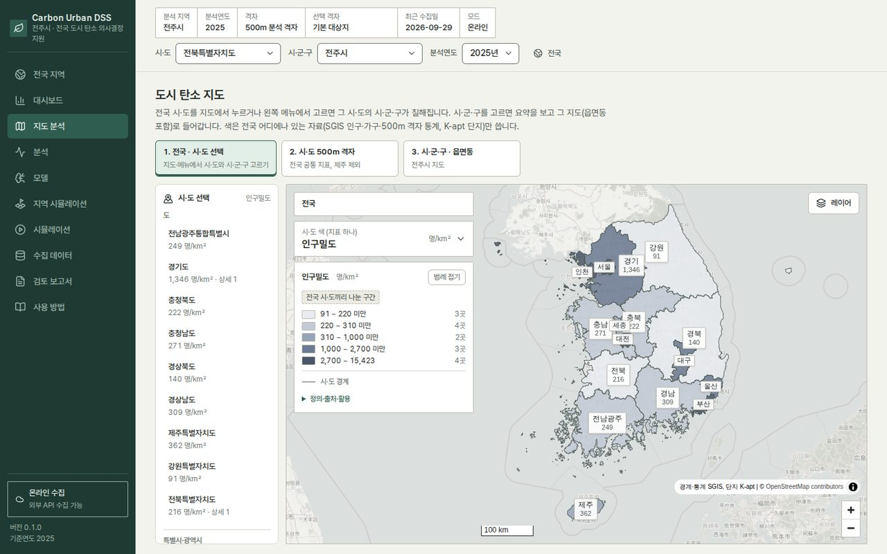

1. **시·도 고르기**: 지도에서 시·도를 누르거나 왼쪽 메뉴(도 / 특별시·광역시)에서 고릅니다. 지도 위 이름표도 누를 수 있습니다.
2. **지표 바꾸기**: "시·도 색"에서 인구 · 인구밀도 · 가구 · 인구 증감률(2015→2024) · 주택 · 종사자 · K-apt 단지, 전력 4개(건물 전력 사용량 · 가구당 주택용 전력 · 건물 전력 증감률(2018년 대비) · 전력 사용량 합계, 한전 시군구별 판매량 2025), 온실가스 3개(건물 등 온실가스 · 건물 등 배출 증감률(2018년 대비) · 총배출량, 온실가스종합정보센터 지역 인벤토리 2023) 중 하나를 고릅니다.
3. **범례 읽기**: 구간별 색과 곳 수가 나옵니다. 빗금은 "빠진 블록·통계 없음"이며 0이 아닙니다. "정의·출처·활용"을 펼치면 설명이 나옵니다.

색은 전국 어디에나 있는 자료(SGIS 인구·가구, SGIS 500m 격자 통계, K-apt 단지 목록, 한전 시군구별 전력판매량, 지역 온실가스 인벤토리)만 씁니다. 시·도를 고르면 왼쪽 요약에 한국가스공사 도시가스 판매량(2024년, 2018년 대비)도 나옵니다.

### 4.2 시·도 — 시·군·구 비교

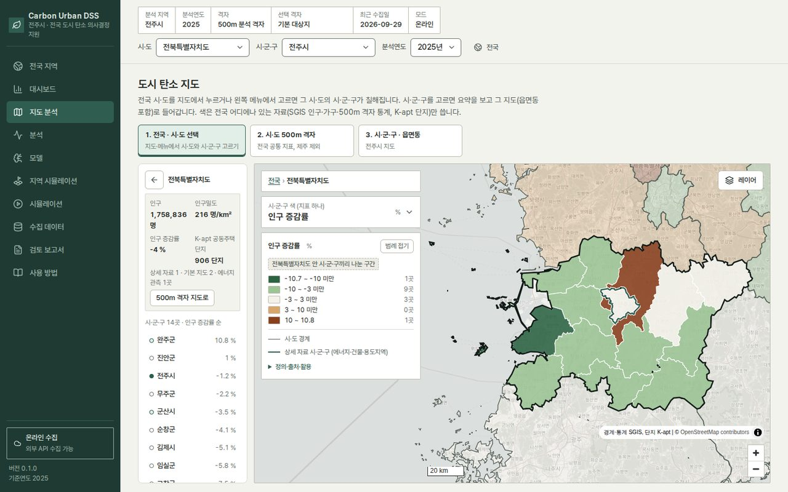

1. **시·도 요약**: 왼쪽 위에 인구·밀도·증감률·단지 수와 상세 자료·기본 지도 지역 수가 나옵니다.
2. **시·군·구 순위**: 지금 지표 순서로 나열됩니다. ● 상세 자료 ◐ 기본 지도 ○ 지도 없음.
3. **색 구간**: 시·도 안 시·군·구끼리 나눈 구간입니다. 인구 증감률은 감소(초록)·증가(갈색)로 칠합니다.
4. **시·군·구 누르기**: 지도나 목록에서 누르면 요약이 열립니다. 위쪽 "전국 ›"으로 돌아갑니다.

### 4.3 시·군·구 요약 — 지도로 들어가기

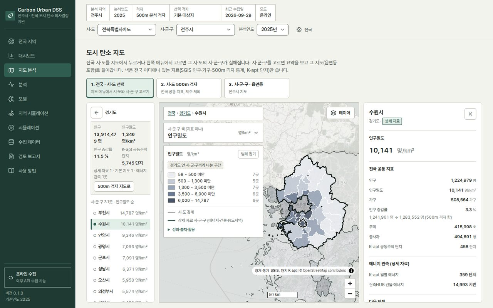

1. **전국 공통 지표**: 인구·가구·밀도, 500m 격자로 모은 증감률·주택·종사자, K-apt 단지 수.
2. **에너지 관측**: K-apt 월별 에너지 단지 수와 건축HUB 건물 에너지 지번 수. 없으면 "상세 자료 수집"으로 모읍니다.
3. **지도 열기 (읍면동 포함)**: 그 시·군·구가 분석 지역이 됩니다. 처음 여는 곳은 전국 자료로 몇 초 만에 기본 지도를 만듭니다.

### 4.4 시·도 500m 격자

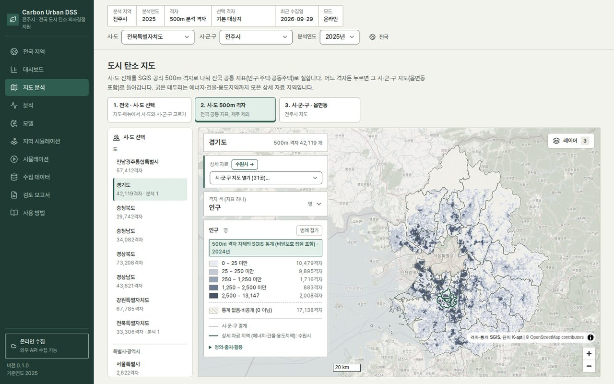

- **500m 격자 자체의 통계**: SGIS 자료제공 신청분(2000~2024) 인구·가구·주택·종사자와 2015년 대비 인구 증감률. 첫 지표는 500m 인구입니다.
- **1km 비율과 공동주택**: 65세 이상·노후 주택·아파트 비율은 소속 1km 격자 값, K-apt 단지 수와 평균 사용승인연도는 격자 안에서 센 값입니다.
- **격자 누르기**: 그 격자의 시·군·구 지도(읍면동 포함)로 들어갑니다. 제주는 이 화면에서만 뺍니다.

### 4.5 시·군·구 지도와 격자 상세

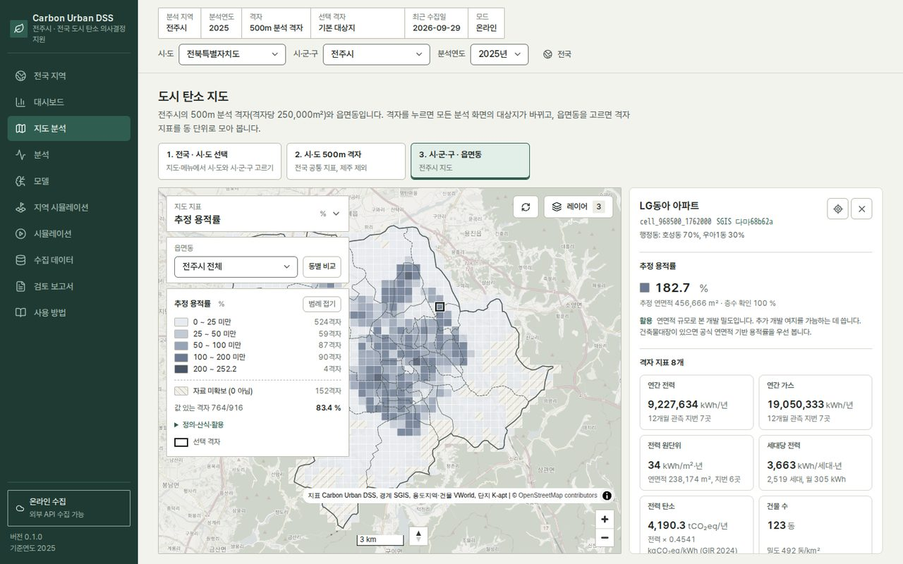

- **지표 묶음 10개, 지표 36개**: 에너지 관측 · 에너지 원단위 · 탄소 · 건물 전체 에너지 · 도시 형태 · 건축물대장 · 토지이용 · SGIS 500m · SGIS 1km · 데이터 품질. 격자 색은 한 번에 하나만 칠합니다.
- **레이어 8개**: 건물·공동주택 단지·용도지역·행정동 인구는 "겹쳐 보기"에서 한 번에 하나만 켭니다. 격자·경계선·읍면동 경계·배경지도는 따로 켜고 끕니다.
- **격자 누르기**: 그 격자가 모든 화면의 선택 격자가 되고 오른쪽에 상세가 열립니다.

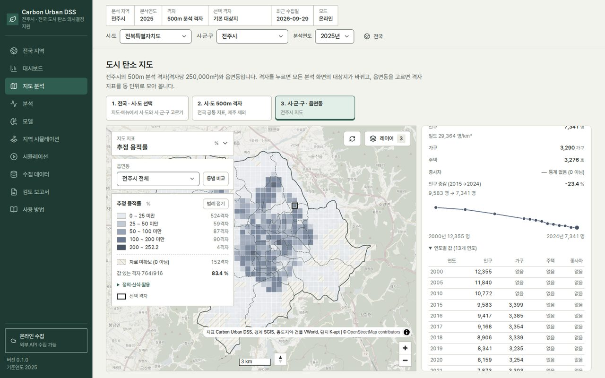

- 고른 지표 값과 근거, 연간 전력·가스·원단위·탄소·건물 수·건폐율·용적률, 월별 관측, 기상.
- **SGIS 500m 격자 자체**: 인구·가구·주택·종사자와 2015년 대비 증감, 연도별 인구 선과 연도별 값 표.
- **비밀보호 표시**: 인구 5 미만은 0·5, 사업체 3 미만은 0·3으로 바뀌고 그 이상은 잡음이 있습니다. "없음"은 통계 없음(0 아님)입니다.

### 4.6 읍면동

| 읍면동 고르기 | 동별 비교 |
|---|---|
| 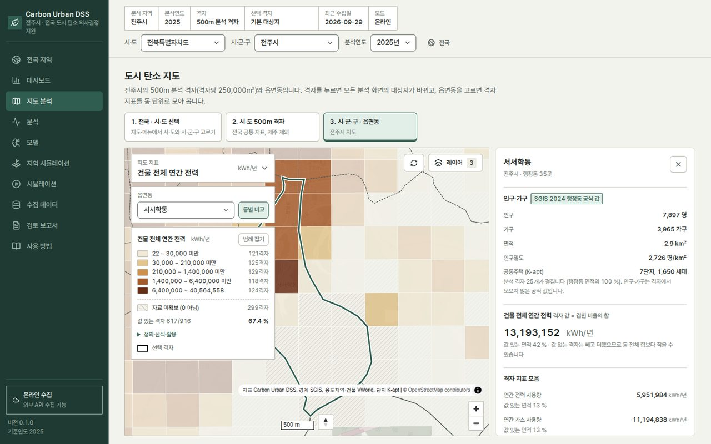 | 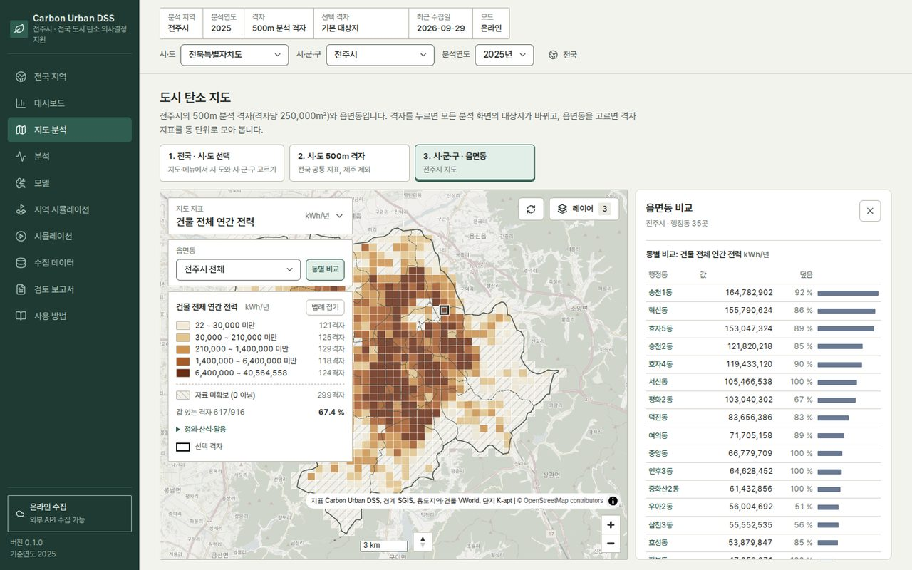 |
| 지도 왼쪽 "읍면동"에서 동을 고르면 경계가 굵어지고 밖은 옅어집니다. 공식 인구·가구와 격자 지표를 동으로 모은 값이 나옵니다. | "동별 비교"를 누르면 지금 지표로 행정동 순위가 나옵니다. "덮음"은 값 있는 격자가 덮는 동 면적 비율입니다. |

격자 값은 겹친 면적 비율로 동에 모읍니다. 합계 지표는 값 × 비율의 합, 비율 지표는 가중 평균입니다. 덮음이 낮으면 합계가 작게 나온다는 점을 함께 보여 줍니다.

## 5. 지역 바꾸기

머리의 **시·도 → 시·군·구** 선택 상자로 어느 화면에서든 전국 어디나 고릅니다.

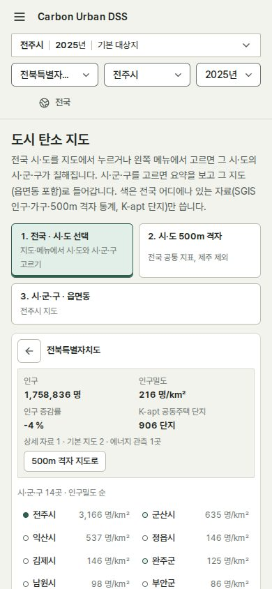

1. **시·군·구 목록 묶음**: 상세 자료(에너지·건물·용도지역) / 기본 지도(전국 공통 자료) / 지도 없음(처음 열면 몇 초)으로 나눠 보여 줍니다. "전국 지도에서 고르기…"도 있습니다.
2. **지도가 없으면 먼저 만듭니다**: 머리 아래에 "지도를 만드는 중" 알림이 뜨고, 끝나면 멈췄던 화면이 스스로 다시 읽습니다.
3. **기본 지도 지역 안내**: 에너지·탄소·건물·용도지역이 없는 곳은 분석 화면 위에 "값은 비어 있으며 0이 아님"을 알리고, 상세 자료 수집으로 이어 줍니다.

휴대폰에서도 같은 순서로 씁니다(메뉴는 왼쪽 위 단추).

 

## 6. 대시보드 · 분석

| 대시보드 | 분석 |
|---|---|
| 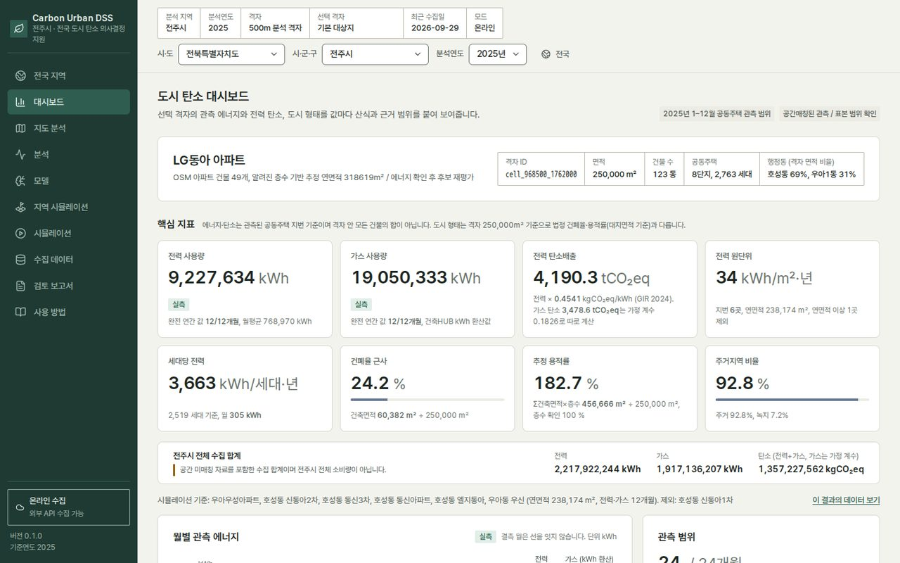 | 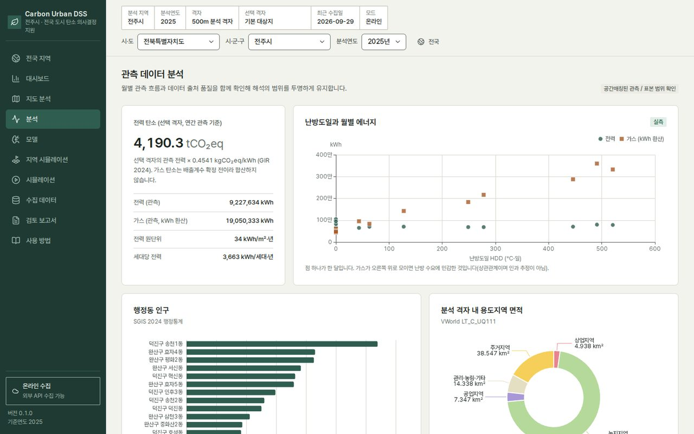 |
| 선택 격자의 전력·가스·전력 탄소·원단위·건폐율·용적률 카드, 지역 전체 수집 합계, 월별 관측과 관측 범위(24개월 중 몇 달). 값마다 산식과 근거 범위가 붙습니다. | 난방도일과 월별 에너지의 관계, 행정동 인구, 격자 안 용도지역 면적, 포함된 출처. 해석 범위를 판단하는 화면입니다. |

## 7. 지역 시뮬레이션

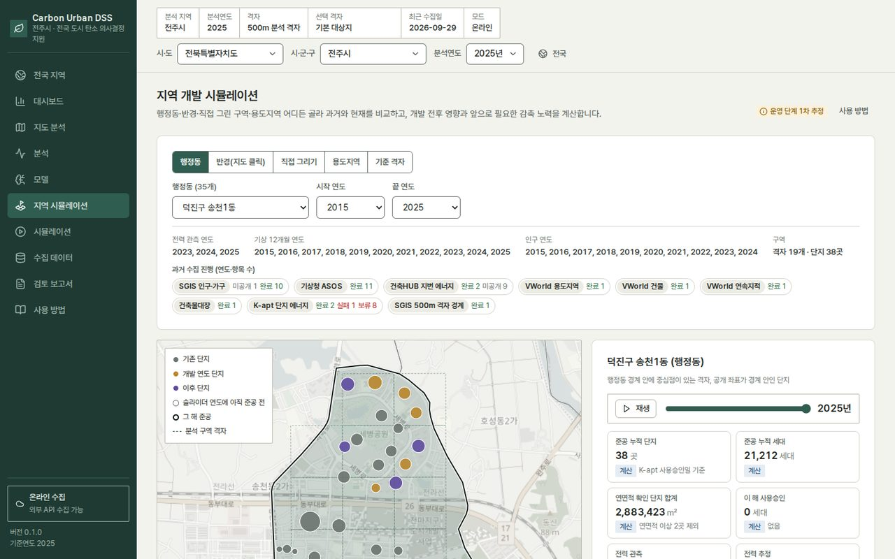

구역 고르는 방법 5가지: 행정동 · 반경(100~5,000m) · 직접 그리기 · 용도지역 · 기준 격자.

1. **과거와 현재**: 2015~2025 연도별 전력(관측·추정), 개발 이력, 기상·인구. 연도 슬라이더로 준공 단지를 봅니다.
2. **개발 전후**: 개발 연도 앞뒤 1~5년 평균을 비교하고, 이 개발만의 연면적·전력 증가를 추정합니다.
3. **목표 감축 노력**: 목표 감축률을 넣으면 필요한 감축량, 효율 개선률, 재생에너지 상쇄량이 나옵니다. 지역 보고서로 저장합니다.

## 8. 시뮬레이션

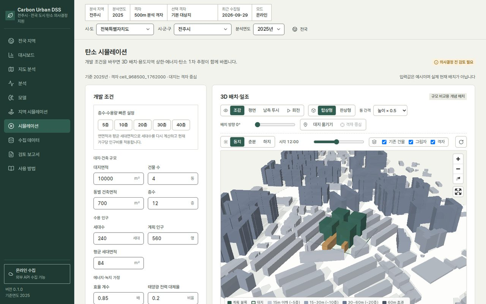

1. **계획 조건**: 층수 빠른 설정(5~40층)이나 직접 입력 — 대지·동수·건축면적·세대·인구·효율·태양광·녹지.
2. **최적안 탐색**: 최소 세대수·인구를 만족하는 후보를 같은 조건에서 항상 같은 순서로 보여 줍니다.
3. **3D 배치·일조**: 기존 공식 건물과 계획 블록을 같은 축척으로 세우고, 동지·춘분·하지 시각의 그림자와 닿는 건물 수를 봅니다.
4. **법적 상한**: 조례 → 시행령 제84·85조 → 국토계획법 제79조 순서의 건폐율·용적률 상한과 비교합니다.

## 9. 모델 · 검토 보고서

| 모델 | 검토 보고서 |
|---|---|
| 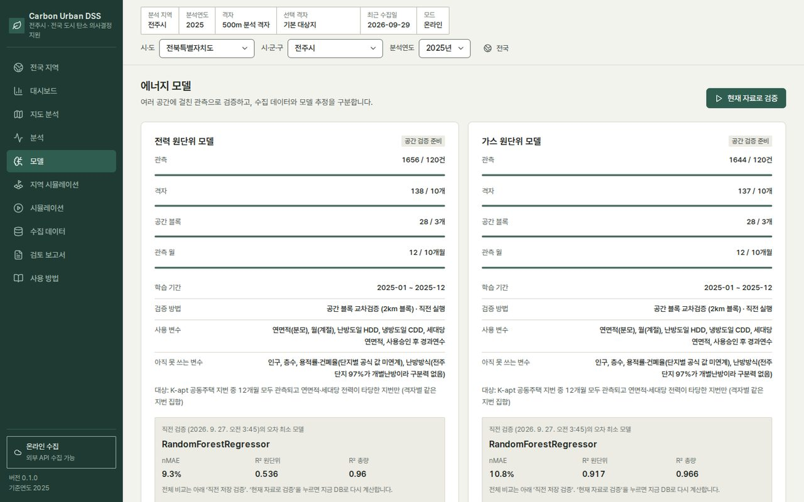 | 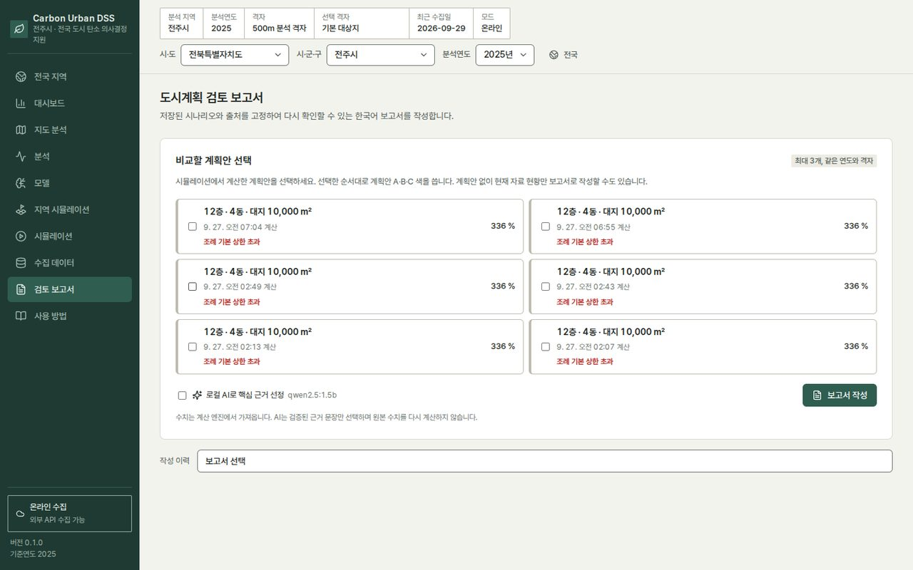 |
| 전력·가스 원단위 모델을 2km 공간 블록 교차검증으로 평가합니다(nMAE·R²). 관측이 부족하면 성능을 만들지 않고 "학습 자료 부족"으로 표시합니다. 아래 **공식 통계와 맞대기**는 이 지역 합계를 한전 전력·온실가스 인벤토리·SGIS 인구와 비교하고, 가스 지번의 연간 완전성(여름 격월 고지 포함)을 보여 줍니다([정확도 평가](ACCURACY.md)). | 같은 연도·격자의 계획안을 최대 3개 골라 보고서를 만듭니다. 요약 → 대상지 → 현황 → 계획안 비교 → 유의사항 → 출처 순서, 마크다운·PDF. |

## 10. 자료 수집 · 전국 지역

| 수집 데이터 | 전국 지역 |
|---|---|
| 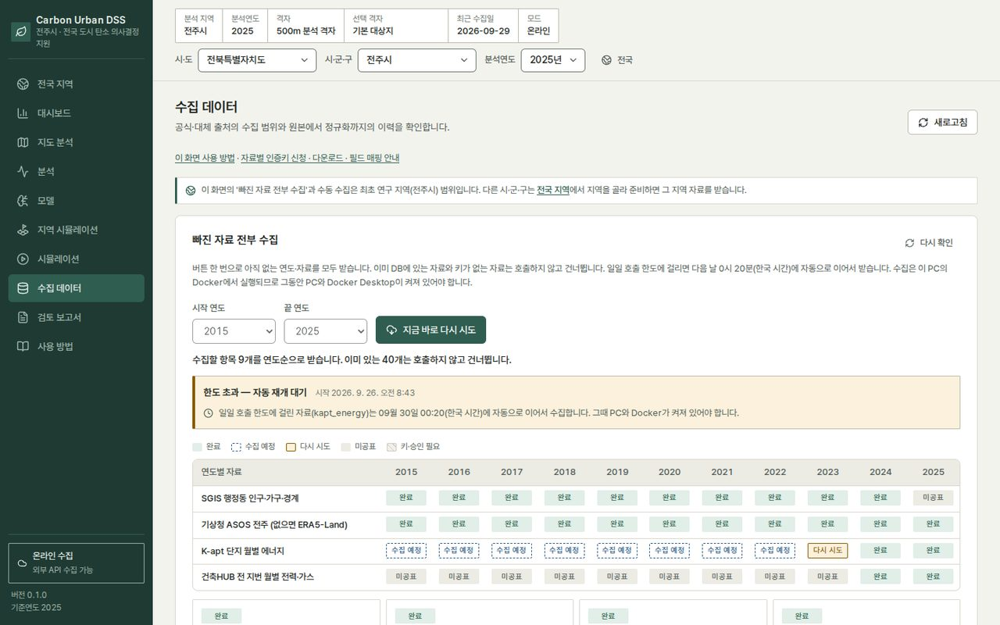 | 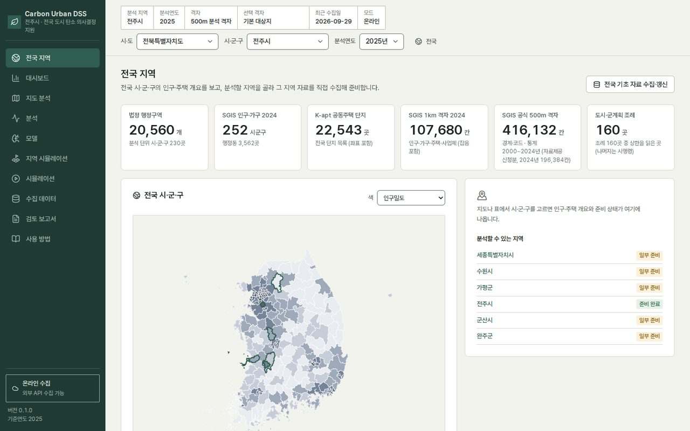 |
| "빠진 자료 전부 수집"으로 연도·자료별 빈칸을 한 번에 받습니다. 한도에 걸리면 00:20에 이어 받고, API로 못 받는 자료는 수동 자료 목록과 파일 업로드로 넣습니다. | 전국 시·군·구 표와 지도, 전국 기초 자료 상태. 고른 지역의 "상세 자료 수집"은 격자 → 행정동 → 건물·용도지역 → 에너지 순서로 받습니다. |

## 11. 값 읽는 법

| 배지 | 뜻 |
|---|---|
| 관측 | 공공기관이 측정·공표한 값 |
| 계산 | 관측값에 공식 계수·면적을 곱한 값 |
| 추정 | 가정이 들어간 근사값 (차트 점선) |
| 시나리오 | 계획안 입력에 따른 가정 결과 |
| 대체 | 공식 자료가 없어 다른 출처를 쓴 값 |
| 자료 없음 | 계산하지 않음. 빗금·"—"·사유로 표시하며 0이 아님 |

- 연간 값은 12개월 모두 관측된 지번만 씁니다. 일부 달만 있는 지번은 빼고, 그 수를 함께 적습니다.
- 행정동 통계(인구·가구)는 격자로 나눠 배분하지 않습니다. 격자에는 SGIS 격자 통계를 따로 씁니다.
- 전력 탄소는 등록된 전력 배출계수(0.4541 kgCO₂eq/kWh)를, 도시가스는 "가정" 계수(0.1826 kgCO₂eq/kWh)를 따로 표시해 씁니다.
- 500m 합계는 파일이 있는 블록에 사는 사람이 99% 이상일 때만 보여 주고 빠진 몫을 적습니다. 증감률은 95% 이상일 때 두 해 같은 블록끼리 비교합니다.

## 12. 자료 현황과 보충 자료

2026-09-29 PC DB 실측입니다.

| 전국 어디나 할 수 있는 분석 | 상세 자료가 있는 곳만 (전주시·수원시) |
|---|---|
| 인구·가구·밀도, 2015→2024 인구 증감, 주택·종사자 | 건축HUB 건물 에너지 (전주 2024~2025, 수원 2025) |
| 연령·노후 주택·아파트 비율 (1km 격자 2024) | K-apt 월별 에너지 (수원은 호출 한도로 이어 받는 중) |
| 공동주택 분포, 조례 건폐율·용적률 상한 (160곳) | 건축물대장 13.4만 건, VWorld 건물·필지·용도지역 |
| 어느 시·군·구든 격자·읍면동 기본 지도 (수 초) | 에너지·탄소 모델 학습과 검증 |
| 시·군·구 전력 판매량(한전, 2015~2025)과 공식 온실가스 인벤토리(GIR, 2010~2023) | |

2026-09-30에 한전 시군구별 전력판매량, 온실가스종합정보센터 지역 온실가스 인벤토리, 한국가스공사 시·도 도시가스 판매량, 공표 회차별 전력 배출계수 원문을 받아 적용했습니다. 아직 보충하면 전국 분석이 넓어지는 자료(자세한 링크와 방법은 [NATIONWIDE_DATA.md](NATIONWIDE_DATA.md) 3절, 앱의 **수집 데이터 → 수동 자료**):

1. SGIS 500m 격자 통계 다시 신청 — 빠진 17개 블록(약 110만 명)과 다마 블록 사업체·종사자·주택
2. 건물에너지 전국 파일(전기·가스) — API 한도 없이 어느 시·군·구든 건물 에너지 (건축HUB 누리집, 전국 약 7,600만 행이라 가져오기를 새로 만들어야 함)
3. GIS건물통합정보·연속지적·용도지역 파일 — 호출 없이 전국 상세 지도 (V-World 누리집의 시·도별 SHP)
4. K-apt API 호출 한도 상향, 공식 도시가스 배출계수, 2025 승인 전력 계수 적용 여부

## 13. 문제 해결

- **화면이 열리지 않습니다**: Docker Desktop이 켜져 있는지 확인하고 런처를 다시 실행하세요. 다른 기기에서는 `data/deployment/public-url.txt`의 최신 주소를 씁니다.
- **"자료 없음"과 빗금이 많이 보입니다**: 아직 수집하지 않았거나 제공기관이 공표하지 않은 값입니다. 0으로 채우지 않습니다. 수집 데이터에서 빠진 자료를 수집하세요.
- **처음 고른 시·군·구가 바로 안 열립니다**: 전국 공통 자료로 기본 지도를 만드는 중입니다(몇 초). 끝나면 화면이 스스로 다시 읽습니다. 전국 지도는 처음 한 번 경계를 합치느라 15~25초 걸리고 그다음부터는 바로 열립니다.
- **"한도 초과 — 자동 재개 대기"로 멈춰 있습니다**: 정상입니다. 다음 날 0시 20분(한국 시간)에 이어 받습니다. 그때 PC와 Docker가 켜져 있어야 합니다.
- **데이터를 지우지 않으려면**: `docker compose down -v`는 수집한 DB를 지우므로 쓰지 마세요. 서버를 멈출 때는 `docker compose stop`(데이터 유지)을 씁니다.

## 14. 활용 예시

PC의 실제 DB(관측 기준값) 위에서 2026-10-01에 이 도구로 계산한 값입니다. 계획·목표는 가상의 입력입니다. 자세한 화면과 원고는 [소개와 활용 자료](presentation/Carbon-Urban-DSS-소개와-활용.pptx)에 있습니다.

| # | 누가 | 질문 | 메뉴 | 결과 |
|---|---|---|---|---|
| 1 | 시행사·건설사 | 고효율 설계를 하면 탄소가 얼마나 줄까? (전주 2만㎡, 15층 4동 480세대) | 시뮬레이션 | 일반 1,361t → 고효율 1,089t → 고효율+태양광 15% 1,000t/년(−26.5%) |
| 2 | 설계사무소 | 조례 상한 안에서 어떤 배치가 좋을까? (400세대 이상) | 시뮬레이션 → 최적화 | 646개 중 44개 적합. 22층 2동 414세대 802t ↔ 26층 2동 489세대 948t |
| 3 | 전국 사업 건설사 | 같은 계획을 수원에서 하면? | 시뮬레이션 | 용적률 240%가 수원 조례 상한 192% 초과, 대지 95% 지구단위계획구역 |
| 4 | 도시가스·전력 공급사 | 1,000세대 단지의 월별 수요는? | 시뮬레이션 | 전력 연 3.06GWh(8월 346MWh 최대), 가스 연 6.37GWh(2월이 8월의 8배) |
| 5 | 지자체 | 반경 2km에 10만㎡ 신축 + 20% 감축 목표 | 지역 시뮬레이션 | 신축만으로 불가능 → 전 건물 22.6% 효율 개선 또는 태양광 약 15MW |
| 6 | ESCO | 노후·가스 다소비 격자는? | 지도 분석 | 조건 맞는 57곳 중 상위 5곳 20% 절감 시 연 21.2GWh, 약 3,878t |
| 7 | 태양광 사업자 | 건물 전력이 큰 격자는? | 지도 분석 | 상위 5개 격자가 전주 계측 건물 전력의 8.4%, 10% 상쇄에 격자당 2.5~3.1MW |
| 8 | 관리사무소·자산운용 | 우리 단지는 이웃보다 많이 쓰나? | 지도·대시보드 | 세대당 전력 중앙값 4,476kWh, 상위 25% 5,297kWh 초과 |
| 9 | 디벨로퍼·지자체 평가 | 개발 뒤 기존 단지 사용은 늘었나? | 지역 시뮬레이션 | 합계 +56.3%, 같은 103개 단지 +4.8% |
| 10 | 광역 에너지 정책 | 전북 시·군 건물 전력 증감 | 전국 지도 | 2018→2025 모든 시·군 증가(+4.6~+22.3%), 온실가스는 계수 하락으로 감소 |
| 11 | 도시가스사·설계 | 난방방식별 가스 수요 | 지도·모델 | 수원 가스 원단위 중앙값 지역난방 3.0 vs 개별난방 71.8kWh/㎡ (약 24배) |
