# Carbon Urban DSS 사용자 매뉴얼

| 항목 | 내용 |
|---|---|
| 문서 번호 | CUD-UM-001 |
| 판 | 1.0 (2026-10-08) |
| 대상 | 도시계획·개발사업 검토자, 에너지·탄소 담당자, 프로젝트 팀원 |
| 적용 버전 | Carbon Urban DSS 0.1.0 (GitHub `shy0401/Carbon-Urban-DSS` main) |
| 기준 자료 | PC DB 2026-10-08 03:26 기록 (5절의 값은 이 자료에서 계산), 사례 파일 `backend/cases/simulation_cases.json` |
| 관련 문서 | [공통 데이터 기준](DATA_STANDARD.md) · [팀원 PC 재현](TEAM_SETUP.md) · [사용 방법 요약](USAGE.md) · [한계](LIMITATIONS.md) |

> 이 매뉴얼의 숫자는 모두 이 도구가 실제 DB 위에서 계산한 값입니다. 계획 면적·목표 감축률 같은 **입력은 예시(가상)** 이고, 결과는 그 입력에 대한 1차 추정입니다. 인허가·설계 수치로 쓰지 않습니다.

## 목차

1. 제품 개요
2. 설치와 실행
3. 자료 범위
4. 화면별 기능
5. 실습: 지역을 골라 시뮬레이션하기 (사례 25개)
6. 결과 읽는 법
7. 보고서
8. 자료를 더 모으기
9. 다른 PC에서 같은 결과 확인하기
10. 문제 해결
11. 한계와 주의
- 부록 A 계산식 · 부록 B 용어 · 부록 C 명령어 · 부록 D 사례 입력값

---

## 1. 제품 개요

### 1.1 무엇을 하는 도구인가

Carbon Urban DSS는 **관측된 건물 에너지 사용량으로 도시의 운영 탄소를 계산**하고, 개발 계획이 그 탄소를 어떻게 바꾸는지 미리 보는 의사결정 지원 도구입니다.

| 할 수 있는 일 | 쓰는 메뉴 | 결과 |
|---|---|---|
| 지역(행정동·반경·용도지역·격자)의 과거~현재 전력·탄소 보기 | 지역 시뮬레이션 | 연도별 관측 전력, 개발 이력, 기상, 인구 |
| 과거 개발이 지역 전력을 얼마나 바꿨는지 보기 | 지역 시뮬레이션 → 개발 전후 영향 | 개발 연도 앞뒤 평균 비교, 추정 증가량 |
| 앞으로 개발하면서 목표 감축률을 지키려면 무엇이 필요한지 | 지역 시뮬레이션 → 미래 개발과 감축 노력 | 필요 감축량(t), 효율 개선률(%), 재생에너지 kWh, 태양광 kW |
| 대지에 건물 배치안을 놓고 3D로 보기, 연간 탄소 추정 | 시뮬레이션 | 3D 배치·일조, 용적률·건폐율, 월별 전력·가스·탄소 |
| 계획안이 용도지역·조례 상한 안인지 1차 확인 | 시뮬레이션 | 용도지역 비율, 조례 상한, 이내/초과 |
| 상한 안에서 탄소가 적은 층수·동수 찾기 | 시뮬레이션 → 최적안 탐색 | 후보 3개(탄소 최소, 세대당 최소, 수용량 최대) |
| 근거가 고정된 보고서 작성 | 검토 보고서, 지역 시뮬레이션 → 보고서 | 화면·마크다운 보고서, 근거 SHA-256 |
| 전국 어느 시·군·구든 기본 지도와 인구·주택 개요 | 전국 지역, 지도 분석 | 시·도 → 시·군·구 → 읍면동 |

### 1.2 하지 않는 것

- **인허가 판단을 하지 않습니다.** 용도지역·조례 상한은 1차 확인이며 지구단위계획·완화 규정이 우선합니다.
- **넷제로 달성을 판정하지 않습니다.** 감축 노력은 전력 운영 탄소 기준의 역산입니다(가스는 가정 계수로 따로 표시).
- **빈 값을 0으로 채우지 않습니다.** 관측이 없으면 "자료 없음"으로 보여 줍니다.
- **숫자를 AI가 만들지 않습니다.** 보고서의 숫자는 계산 엔진의 근거 문장에서만 나옵니다(7절).

### 1.3 화면 구성

왼쪽 메뉴와 위쪽 **분석 범위 표**(분석 지역 · 분석연도 · 격자 · 선택 격자 · 최근 수집일 · 모드)로 이루어져 있습니다. 위쪽에서 시·도 → 시·군·구 → 분석연도를 고르면 모든 메뉴가 그 지역 기준으로 바뀝니다.

| 메뉴 | 용도 |
|---|---|
| 전국 지역 | 전국 시·군·구 개요, 상세 자료를 준비한 지역 목록과 상태 |
| 대시보드 | 선택 지역·격자의 연간 에너지·탄소 요약 |
| 지도 분석 | 500m 격자 지도: 전력·가스·탄소·인구·용도지역 등 지표 |
| 분석 | 격자 비교, 조건 검색(예: 노후·가스 다소비 격자) |
| 모델 | 원단위 모델의 공간 교차검증 결과 |
| 지역 시뮬레이션 | 구역을 골라 과거·개발 전후·감축 노력 계산, 지역 보고서 |
| 시뮬레이션 | 3D 계획안, 법적 상한 1차 확인, 최적안 탐색 |
| 수집 데이터 | 출처별 수집 상태, 빠진 자료 전부 수집, 파일 올리기 |
| 검토 보고서 | 격자 보고서(계획안 최대 3개 비교) |
| 사용 방법 | 화면 안내, 데이터 기준 점검 결과 |

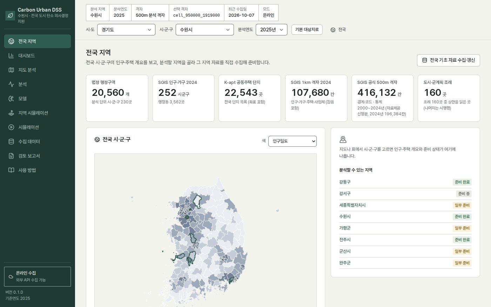

### 1.4 값의 종류 (배지)

| 배지 | 뜻 | 예 |
|---|---|---|
| 관측 | 공공기관이 측정·공표한 값 | 건축HUB 지번 전력, K-apt 단지 전력 |
| 계산 | 관측값에 공식 계수·면적을 곱한 값 | 전력 탄소 = kWh × 0.4330 |
| 추정 | 가정이 들어간 근사값(점선·"추정값") | 연면적 × 지역 원단위, 태양광 발전량 |
| 시나리오 | 계획 입력에 따른 결과 | 계획안 연간 탄소 |
| 대체 | 공식 자료가 없어 다른 출처를 쓴 값 | ERA5 일사량(수원·강동) |
| 자료 없음 | 계산하지 않음(빗금, "—") | 2015~2018 K-apt 전력 |

---

## 2. 설치와 실행

### 2.1 요구 사양

| 항목 | 요구 |
|---|---|
| 운영체제 | Windows 10/11 (WSL2) |
| 프로그램 | Docker Desktop(Linux 엔진), Git for Windows |
| 메모리 | 16GB 이상 권장 (Docker에 8GB 이상) |
| 디스크 | 여유 25GB 이상. Docker 디스크 이미지는 C가 아닌 드라이브에 두어도 됨 |
| 브라우저 | Chrome·Edge 최신판 (3D는 WebGL 사용) |
| 네트워크 | 자료를 새로 받을 때만 필요. 자료 묶음으로 시작하면 오프라인으로도 화면·계산 가능 |

### 2.2 설치 (처음 한 번)

```powershell
git clone https://github.com/shy0401/Carbon-Urban-DSS.git
cd Carbon-Urban-DSS
if (-not (Test-Path .env)) { Copy-Item .env.example .env }   # API 키는 비워 둬도 됨(자료 묶음으로 시작할 때)
scripts\dss.cmd Doctor                                       # Docker·포트·디스크·.env 형식 점검(키 값은 출력하지 않음)
```

### 2.3 자료 묶음 가져오기 (권장)

자료를 가진 PC가 만든 묶음(`carbon-dss-bundle-<시각>.zip`)을 받아 **빈 DB**에 넣습니다.

```powershell
scripts\dss.cmd ImportBundle -BundlePath D:\share\carbon-dss-bundle-20261008-xxxxxx.zip
```

실행기는 ① SHA-256 확인 → ② DB 복원 → ③ 전 테이블 행 수 비교 → ④ 서비스 기동·화면 확인 → ⑤ **묶음에 들어 있는 사례 25개를 이 PC에서 다시 계산해 기준 PC 값과 비교**합니다(9절). 마지막 줄에 `simulation cases: 25/25 match`가 나오면 이 PC의 계산 결과가 기준 PC와 같습니다.

이미 자료가 있는 PC에 팀원 자료를 **더할 때**는 `MergeBundle`을 씁니다([팀원 PC 재현](TEAM_SETUP.md) 2.1-1).

### 2.4 실행·접속·중지

| 하는 일 | 방법 |
|---|---|
| 켜기 | Docker Desktop 실행 → `docker compose -p carbon-urban-dss -f compose.yaml -f compose.demo.yaml up -d` (또는 바탕화면 런처) |
| 접속 | 브라우저 `http://localhost:5173` |
| 끄기(자료 유지) | `docker compose -p carbon-urban-dss -f compose.yaml -f compose.demo.yaml stop` |
| 새 코드 반영 | `git pull` → `scripts\dss.cmd Rebuild` |

> ⚠ `docker compose down -v`는 수집한 DB를 지웁니다. 쓰지 않습니다.

---

## 3. 자료 범위 (2026-10-08 기준)

### 3.1 지역별 상세 자료

| 지역 (코드) | 상태 | 건축HUB 지번 에너지 | K-apt 단지 에너지 | 건축물대장·용도지역·건물·지적 | 일사량(태양광 추정) |
|---|---|---|---|---|---|
| 전주시 (52110) | 준비 완료 · 기본 지역 | 2020~2025 | 2019(일부)~2025 | 있음 | ASOS 146 관측 (2025: 1,500 kWh/m²) |
| 수원시 (41110) | 준비 완료 | 2025 | 2025 | 있음 | ERA5 대체 (2025: 1,470 kWh/m²) |
| 서울 강동구 (11740) | 준비 완료 (10/08) | 2025 | 2025 | 있음 | ERA5 대체 (2025: 1,438 kWh/m²) |
| 부산 강서구 (26440) | 준비 완료 (10/08) | 2025 | 2025 | 있음(용도지역 분류 점검 필요) | ERA5 대체 (2025: 1,618 kWh/m²) |
| 세종시 (36110) | 일부 준비 | 예정 | 예정 | 예정 | ERA5 |
| 완주군 (52710) | 일부 준비 | 재시도 필요 | 2025 | 대장 재시도 필요 | ERA5 |
| 전국 시·군·구 | 기본 지도 | — | 단지 목록 | — | — |

- 건축HUB는 **2020-01 사용분부터** 제공합니다(2015~2019 없음). 단독주택·200세대 미만 공동주택은 제공 범위 밖입니다.
- K-apt 2015~2018 전력은 아직 없습니다(일일 호출 한도로 이어 받는 중). 화면에는 "자료 없음"으로 나옵니다.
- 출처·단위·기준 시점의 전체 표: [공통 데이터 기준 2절](DATA_STANDARD.md#2-출처별-수집-기준).

### 3.2 계수

| 항목 | 값 | 비고 |
|---|---|---|
| 2025년 전력 배출계수 | 0.4330 kgCO2eq/kWh | GIR 2025 승인 '21~'23 평균 |
| 2022~2024 | 0.4781 | 2021 승인 |
| 2019~2021 | 0.4594 | 2018 승인 |
| 도시가스 | 0.1826 kgCO2eq/kWh | **가정** 계수(공식 계수 확정 전) |
| 태양광 성능비 | 0.80 | 수평면 일사량 × 0.80 (경사 보정 없음) |

---

## 4. 화면별 기능

### 4.1 분석 범위 정하기

1. 위쪽 **시·도**에서 지역이 속한 시·도를 고릅니다(예: 경기도).
2. **시·군·구**에서 지역을 고릅니다(예: 수원시). 상세 자료가 없는 곳은 전국 공통 자료로 기본 지도를 몇 초 안에 만듭니다.
3. **분석연도**를 고릅니다. 기본은 12개월이 다 모인 최근 연도(2025)입니다.
4. **기본 대상지로** 버튼은 그 지역의 기본 대상지 격자(K-apt 세대수가 가장 많은 격자)로 돌아갑니다.

### 4.2 지역 시뮬레이션

**구역을 고르는 5가지 방법**

| 방법 | 쓰는 때 | 링크 표기 |
|---|---|---|
| 행정동 | 동 단위 정책·통계와 맞출 때 | `area=admin:35012650` |
| 반경(지도 클릭) | 개발 예정지 주변 영향 | `area=circle:경도,위도,반경m` |
| 직접 그리기 | 사업 경계를 그대로 | (링크 불가) |
| 용도지역 | 상업지역 전체 등 용도별 비교 | `area=zone:COMMERCIAL` |
| 기준 격자 | 500m 격자 하나 | `area=grid:cell_966500_1764500` |

**입력**

| 입력 | 뜻 | 예 |
|---|---|---|
| 시작·끝 연도 | 과거 비교 기간 | 2015~2025 |
| 개발 연도 / 비교 창 | 전후 비교할 사용승인 연도, 앞뒤 몇 년 평균 | 자동(세대가 가장 많이 늘어난 해), 3년 |
| 추가·철거 연면적 | 앞으로 지을(헐) 연면적. "층수 × 동수"로도 입력 | 90,000 m² |
| 목표 감축률 | 기준 연도 대비 몇 % 줄일지 | 20% |
| 기준 건물 | **공동주택(K-apt)**: 주거지 기본 / **건물 전체(건축HUB)**: 상가·업무가 많은 곳 | 상업지는 건물 전체 |
| 태양광 kW당 연 발전량 | 비우면 지역 일사량 × 0.80 추정값 | 비움 또는 1,200 |

**결과 영역**: 구역 지도와 연도 슬라이더 → 연도별 전력(K-apt)·개발 이력·기상·인구·건축물대장 → 건물 전체 에너지(건축HUB) → SGIS 지역 특성 → 개발 전후 영향 → 미래 개발과 감축 노력 → 보고서.

**링크 복사**: 구역·기간·계획·목표·기준 건물을 주소 하나로 복사합니다. 다른 사람·다른 PC에서 열면 같은 입력으로 시작합니다(9.3절).

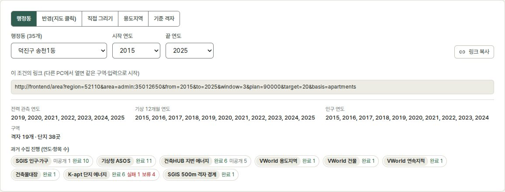

### 4.3 시뮬레이션 (3D 계획안)

**입력 항목**

| 그룹 | 항목 | 단위 | 설명 |
|---|---|---|---|
| 대지·건축 규모 | 대지면적 | m² | 정사각형 대지로 배치 |
| | 건물 수, 동별 건축면적, 층수 | 동, m², 층 | 연면적 = 동수 × 건축면적 × 층수 |
| 수용 인구 | 세대수, 계획 인구, 평균 세대면적 | 세대, 명, m² | 세대수 × 세대면적 ≤ 연면적 |
| 에너지·녹지 가정 | 효율 계수 | 배 | 1.0 = 지역 관측 원단위 그대로, 0.8 = 20% 고효율 |
| | 태양광 전력 대체율 | 0~1 | 0.15 = 전력의 15%를 태양광으로 상쇄 |
| | 녹지 비율 | 0~1 | 공간 제약에만 씀(에너지에 곱하지 않음) |

**3D 조작**: 시점(조감·평면·남측 투시·회전), 배치(탑상형·판상형, 동 간격), 배치 방향(회전), **대지 옮기기**(지도 클릭) / 격자 중심, 일조(동지·춘분·하지, 시각), 기존 건물·그림자·격자 표시, **보고서용 장면 저장**(계산한 계획안에 3D 그림을 붙임).

**결과**: 건축면적·연면적·용적률·건폐율 → 현재/시나리오/증감 탭(전력·가스·전체 탄소·전력 탄소, 월별 차트) → 해석 범위 → **용도지역·조례 상한 1차 확인**(대지에 걸친 용도지역 비율, 조례 상한, 이내/초과, 지구단위계획구역 표시).

**최적안 탐색**: 최소 세대수·인구를 넣으면 대지의 법적 상한 안에서 층수·동수 조합을 모두 계산해 "탄소 최소 · 세대당 탄소 최소 · 수용량 최대" 3개를 보여 줍니다. "이 조건을 입력에 적용"으로 바로 3D에 반영합니다.

### 4.4 검토 보고서

시뮬레이션에서 계산한 계획안 옆의 **이 계획안으로 보고서 작성** → 같은 연도·격자의 계획안을 최대 3개 고름(선택 순서대로 A·B·C) → **보고서 작성**. 보고서는 1 검토 요약, 2 대상지 개요, 3 에너지·탄소 현황, 4 계획안 비교, 5 해석 범위, 6 데이터 출처, 7 재현 정보(보고서 ID, 근거 SHA-256)로 구성됩니다. **문서 내려받기**(마크다운), **인쇄**(PDF로 저장 가능).

### 4.5 그 밖의 메뉴

- **지도 분석**: 지표 선택(건물 전력, 가스 탄소(가정 계수), 인구 등) → 격자 클릭 → 상세(관측 지번 수, 원단위, 용도지역). 시·도 지도는 500m 공식 격자로 전국 공통 지표를 봅니다.
- **수집 데이터**: 출처별 상태, **빠진 자료 전부 수집**(연도·자료별 빈칸을 한 번에), 수동 자료 목록과 파일 올리기.
- **사용 방법 → 데이터 기준**: `check-standard` 점검 결과.

---

## 5. 실습: 지역을 골라 시뮬레이션하기

아래 25개 사례는 `backend/cases/simulation_cases.json`에 입력값 그대로 저장되어 있고, `verify-cases` 명령이 같은 값을 다시 계산해 비교합니다(9절). 사례마다 ① 화면에서 입력하는 순서, ② 그대로 열리는 **사례 링크**, ③ 화면에 나와야 하는 결과(2026-10-08 자료), ④ 해석을 적었습니다.

### 5.0 사례 목록

| ID | 지역 · 구역 | 성격 | 메뉴 | 핵심 입력 |
|---|---|---|---|---|
| D01~D04 | 전주·수원·강동·부산 강서 | 자료 지문 | (명령) | 계산이 읽는 행 수·합계 |
| J01 | 전주 덕진구 송천1동 (에코시티) | 개발지 | 지역 시뮬레이션 | +9만 m², −20%, 공동주택 |
| J02 | 〃 | 개발지 | 지역 시뮬레이션 | J01과 같고 기준 건물만 건물 전체 |
| J03 | 전주 완산구 효자5동 (서부신시가지) | 상업지 | 지역 시뮬레이션 | +7.5만 m², −20%, 건물 전체 |
| J04 | 전주 상업지역이 가장 넓은 격자 18개 | 상업지 | 지역 시뮬레이션 | +5만 m², −20%, 건물 전체 |
| J05 | 에코시티 대지 중심 반경 1km | 개발지 | 지역 시뮬레이션 | +4만 m², −30%, 태양광 1,200 직접 |
| J06 | 에코시티 격자, 3종일반주거 대지 | 개발지 | 시뮬레이션 3D | 4만 m² 대지, 10동×15층, 1,000세대, 일반 |
| J07 | 〃 | 개발지 | 시뮬레이션 3D | J06 + 고효율 0.8 + 태양광 15% |
| J08 | 〃 (대지를 격자 중심에) | 개발지 | 시뮬레이션 3D | J06과 같고 대지 위치만 다름 |
| J09 | 〃 | 개발지 | 최적안 탐색 | 900세대·2,200명 이상 |
| J10 | 서부신시가지 격자, 중심상업 대지 | 상업지 | 시뮬레이션 3D | 1만 m² 대지, 2동×25층 주상복합 600세대 |
| J11 | 〃 | 상업지 | 최적안 탐색 | 500세대·1,200명 이상 |
| J12 | 에코시티 대지 | 개발지 | 법적 상한 | 용적률 225%·건폐율 15% 판정 |
| J13 | 에코시티 격자 | 개발지 | 검토 보고서 | 계획안 A·C 비교 |
| J14 | 송천1동 | 개발지 | 지역 보고서 | J01 조건 |
| S01 | 수원 영통구 광교1동 (광교신도시) | 개발지 | 지역 시뮬레이션 | +6만 m², −20%, 공동주택 |
| S02 | 수원 팔달구 인계동 | 상업지 | 지역 시뮬레이션 | +6만 m², −20%, 건물 전체 |
| S03 | 수원 기본 대상지 격자 | 비교 | 시뮬레이션 3D | J06과 같은 계획안 |
| G01 | 서울 강동구 고덕2동 (재건축 대단지) | 개발지 | 지역 시뮬레이션 | +6만 m², −20%, 공동주택 |
| G02 | 서울 강동구 천호3동 (상업지역 격자) | 상업지 | 지역 시뮬레이션 | +4만 m², −20%, 건물 전체 |
| B01 | 부산 강서구 명지1동 (명지국제신도시) | 개발지 | 지역 시뮬레이션 | +6만 m², −20%, 공동주택 |
| B02 | 부산 강서구 명지1동 상업 중심 격자 | 상업지 | 지역 시뮬레이션 | +3만 m², −20%, 건물 전체 |

> 사례 링크의 `http://localhost:5173`은 자기 PC 주소입니다. 공개 주소로 접속했다면 그 주소로 바꿔 씁니다.

### 5.1 J01 · 전주 개발지 송천1동(에코시티) — 개발 전후와 감축 20%

**입력 순서**

1. 위쪽 범위: 시·도 `전북특별자치도` → 시·군·구 `전주시` → 분석연도 `2025년`.
2. 메뉴 **지역 시뮬레이션** → 구역 방식 `행정동` → `덕진구 송천1동`.
3. 시작 연도 `2015`, 끝 연도 `2025`.
4. 아래 **미래 개발과 감축 노력**: 연면적 직접 → 추가 연면적 `90000`, 철거 `0`, 목표 감축률 `20`, 기준 건물 `공동주택 (K-apt)`, 태양광 발전량은 **비움**.

사례 링크: `http://localhost:5173/area?region=52110&area=admin:35012650&from=2015&to=2025&window=3&plan=90000&target=20&basis=apartments`

**화면에 나와야 하는 결과**

| 항목 | 값 | 종류 |
|---|---|---|
| 구역 | 격자 19개 · 단지 38곳 | — |
| K-apt 12개월 관측 전력 | 2019: 14,374,920 · 2020: 62,485,075 · 2023: 77,741,971 · 2025: **84,145,683 kWh** | 관측 |
| 2015~2018 전력 | 자료 없음 | — |
| 건물 전체 전력(건축HUB) 2025 | 171,888,267 kWh (12개월 계측 지번 489곳) | 관측 |
| 같은 지번 비교 2021→2025 | 414곳 84,437,430 → 139,498,797 kWh (+65.2%) | 계산 |
| 개발 연도(자동) | 2019년: 단지 5개 3,345세대 사용승인 | 관측 |
| 개발로 늘어난 부하(추정) | 단지 연면적 +527,251 m²(+28.1%) → 전력 약 +15,377,255 kWh/년 | 추정 |
| 기준(2025) 전력 탄소 | **36,435.1 t** (원단위 29.06 kWh/m², 연면적 2,782,908 m²) | 계산 |
| 개발 후, 추가 대책 없음 | 37,567.6 t | 시나리오 |
| 목표(−20%) | 29,148.1 t | 시나리오 |
| **필요 감축량** | **8,419.5 tCO2eq/년** | 시나리오 |
| 신축만 효율화 | 743.4% 필요 → 불가 | 시나리오 |
| 지역 전체 건물 효율 개선 | **22.4%** | 시나리오 |
| 재생에너지 상쇄 | 19,444,649 kWh/년 | 시나리오 |
| 태양광 설비 | **16,205.2 kW** (2025 ASOS 일사량 1,500 kWh/m² × 0.80 = 1,199.9 kWh/kW·년, 추정) | 추정 |

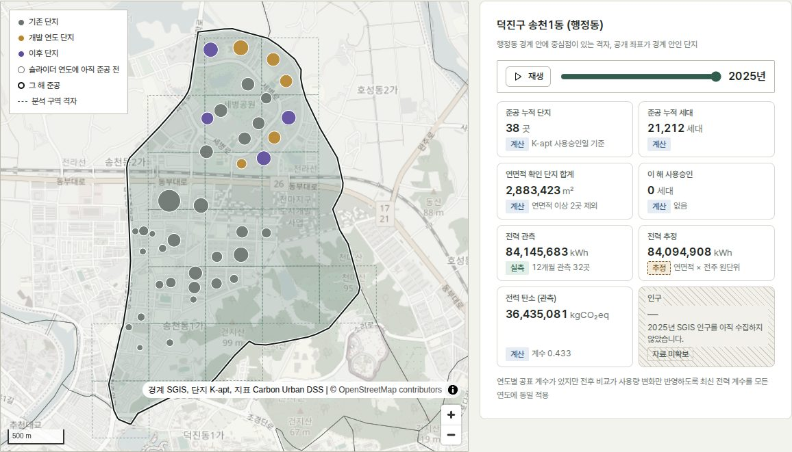

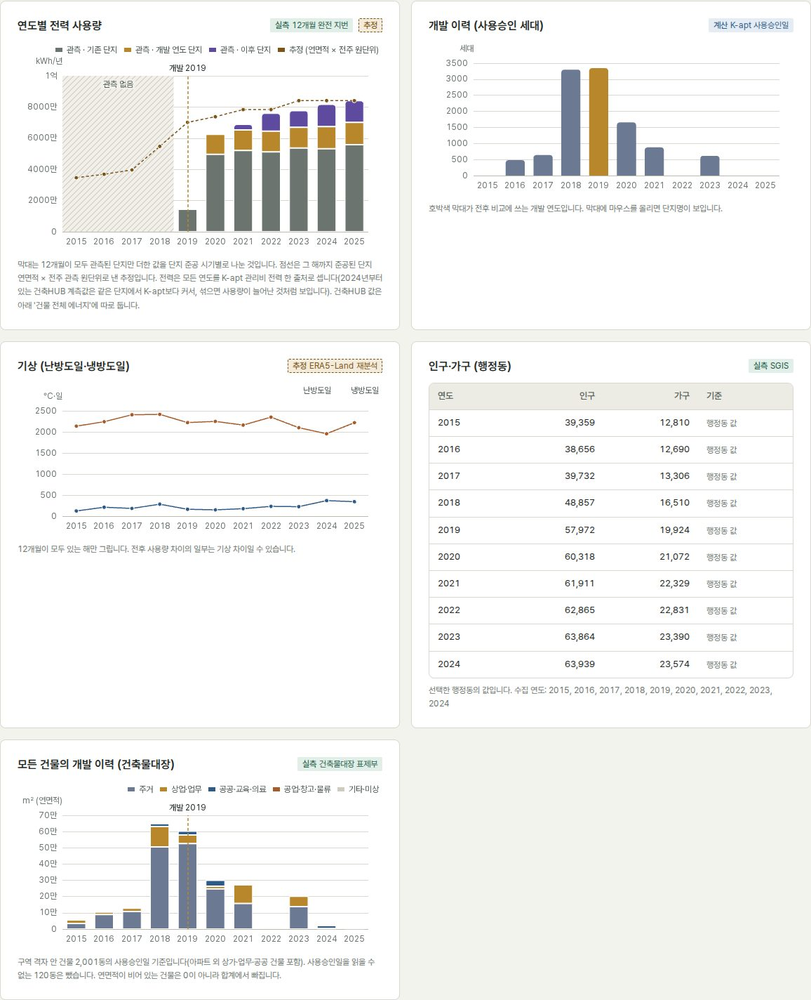

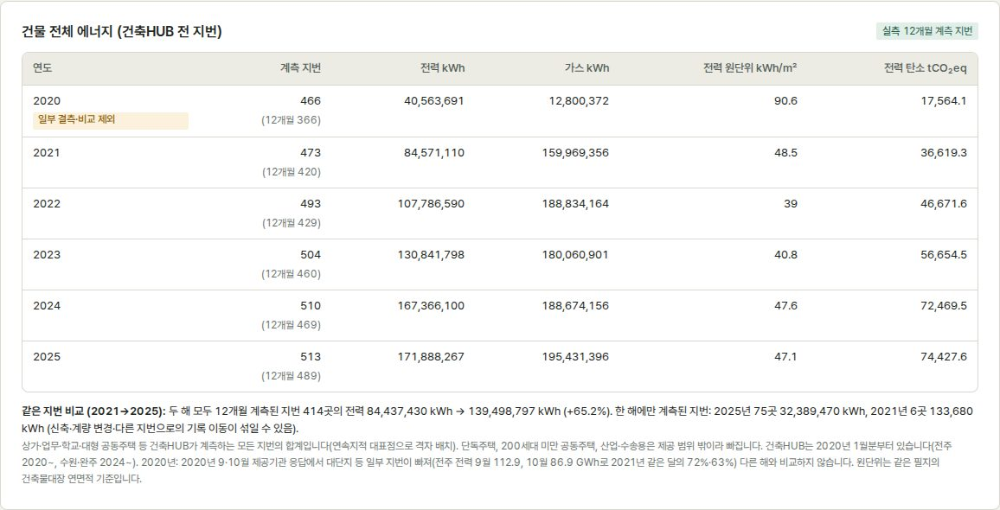

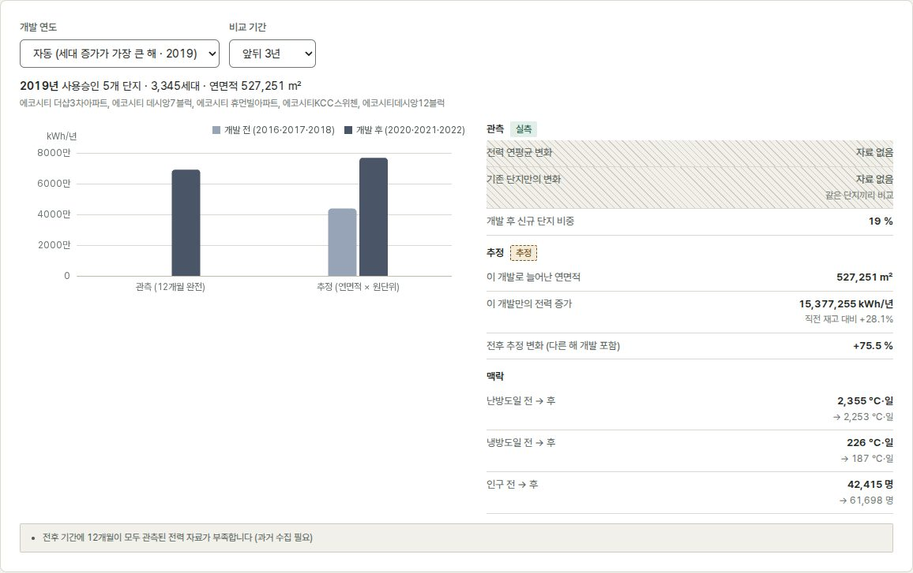

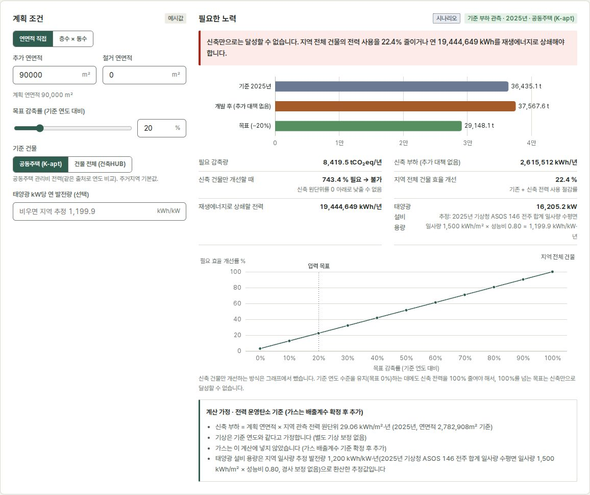

**해석**: 2019년 에코시티 단지 입주로 지역 공동주택 연면적이 28% 늘었고, 관측이 없는 2016~2018년 대신 연면적 × 원단위로 추정하면 연 1,538만 kWh가 늘었습니다. 앞으로 9만 m²를 더 지으면서 2025년보다 20% 줄이려면 신축만으로는 불가능하고(743%), 지역 공동주택 전체가 전력을 22.4% 줄이거나 태양광 약 16 MW가 필요합니다.

### 5.2 J02 · 같은 지역, 기준 건물을 "건물 전체"로

J01에서 **기준 건물**만 `건물 전체 (건축HUB)`로 바꿉니다. 링크: `…&basis=buildings`

| 항목 | 공동주택 기준 (J01) | 건물 전체 기준 (J02) |
|---|---:|---:|
| 기준 전력 2025 | 84,145,683 kWh | 171,888,267 kWh |
| 기준 탄소 | 36,435.1 t | 74,427.6 t |
| 필요 감축량 | 8,419.5 t | 16,720.2 t |
| 지역 전체 효율 개선 | 22.4% | 21.9% |
| 태양광 | 16,205.2 kW | 32,181.7 kW |

**해석**: 감축률(%)은 비슷하지만 절대량(t, kW)은 기준 건물 범위에 따라 2배 차이가 납니다. 보고서·발표에서는 반드시 **기준 건물과 기준 연도**를 함께 적습니다([기준 6절](DATA_STANDARD.md#6-보고서-작성-기준)).

### 5.3 J03 · 전주 상업지 효자5동(서부신시가지) — 건물 전체 기준

입력: 행정동 `완산구 효자5동`, 2015~2025, 추가 연면적 `75000`, 목표 `20`, 기준 건물 **`건물 전체 (건축HUB)`**.
링크: `http://localhost:5173/area?region=52110&area=admin:35011790&from=2015&to=2025&window=3&plan=75000&target=20&basis=buildings`

| 항목 | 값 |
|---|---|
| 구역 | 격자 26개 · 단지 17곳 |
| 건물 전체 전력 2025 | 160,874,572 kWh (K-apt 단지 전력 25,112,588 kWh의 약 6.4배) |
| 기준 탄소 / 개발 후 / 목표 | 69,658.7 t / 71,810.5 t / 55,727.0 t |
| 필요 감축량 | **16,083.5 t/년** |
| 신축만 / 지역 전체 효율 | 747.4% → 불가 / **22.4%** |
| 태양광 | **30,956.3 kW** (1,199.9 kWh/kW·년 추정) |

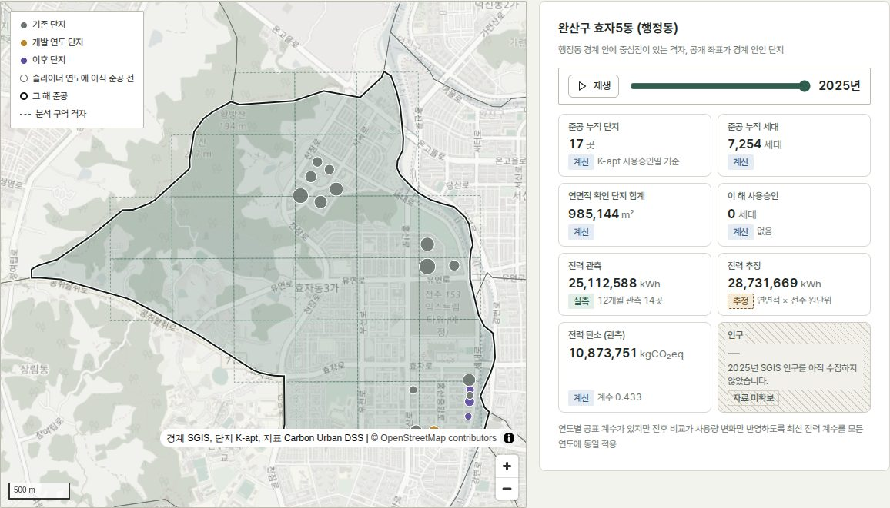

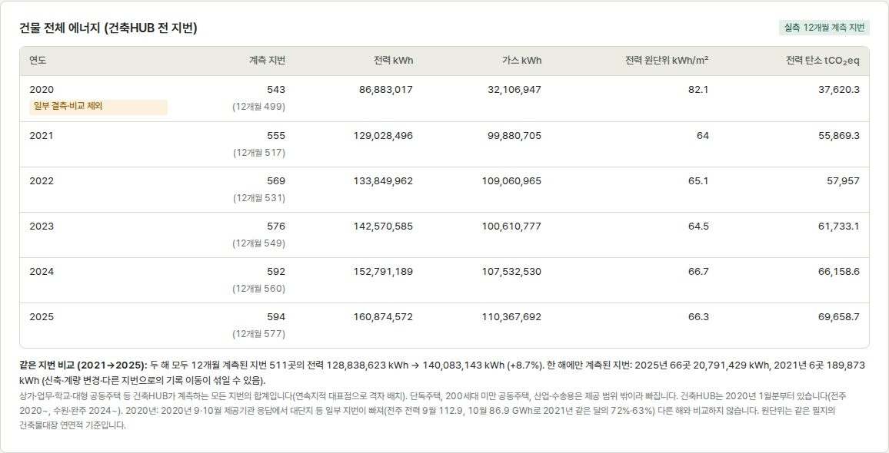

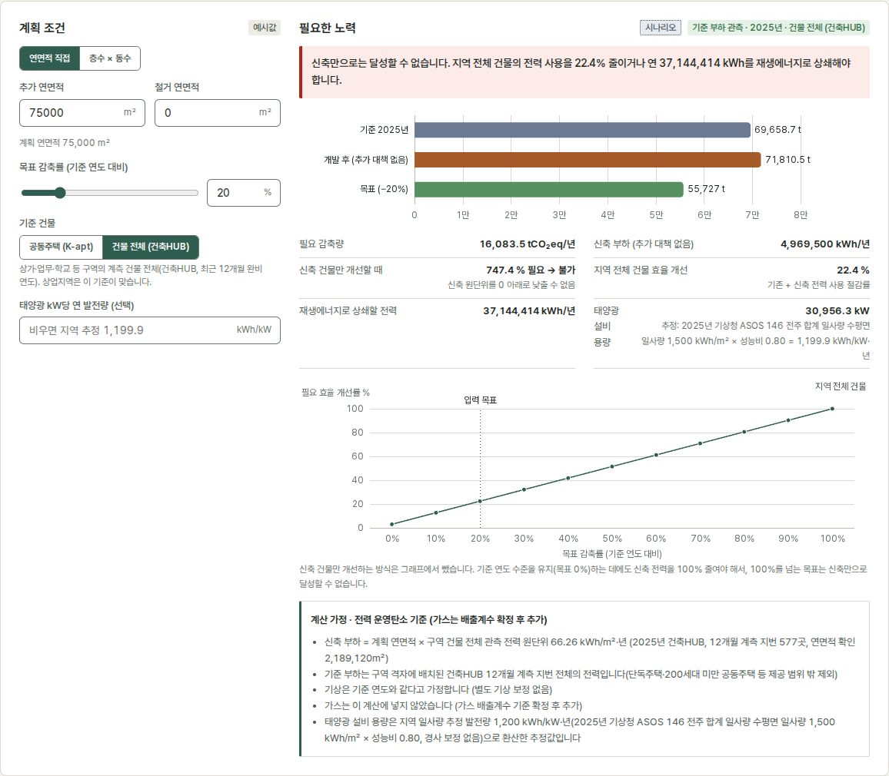

**해석**: 상업지는 상가·업무 건물이 부하의 대부분이라 공동주택 기준으로 계산하면 목표가 실제 부하의 일부에만 걸립니다. 상업지는 **건물 전체** 기준을 씁니다.

### 5.4 J04 · 용도지역으로 고르기, J05 · 반경과 태양광 직접 입력

**J04** 구역 방식 `용도지역` → `상업지역` (상업지역이 가장 넓은 격자 18개), +50,000 m², −20%, 건물 전체.
링크: `…/area?region=52110&area=zone:COMMERCIAL&from=2015&to=2025&window=3&plan=50000&target=20&basis=buildings`
→ 기준 전력 299,191,877 kWh, 기준 탄소 129,550.1 t, 필요 감축 **27,595.9 t**, 지역 전체 효율 **21.0%**, 태양광 53,114.3 kW.

**J05** 구역 방식 `반경(지도 클릭)` → 지도에서 에코시티 대지(위도 35.880124, 경도 127.13219) 클릭 → 반경 `1000` m, +40,000 m², 목표 **30**%, 공동주택, 태양광 발전량 **`1200`** 직접 입력.
링크: `…/area?region=52110&area=circle:127.13219,35.880124,1000&from=2015&to=2025&window=3&plan=40000&target=30&pv=1200&basis=apartments`
→ 격자 12개·단지 15곳, 기준 전력 49,208,945 kWh, 필요 감축 **6,860.6 t**, 지역 전체 효율 **31.5%**, 태양광 **13,203.6 kW**(사용자 입력 1,200 kWh/kW).

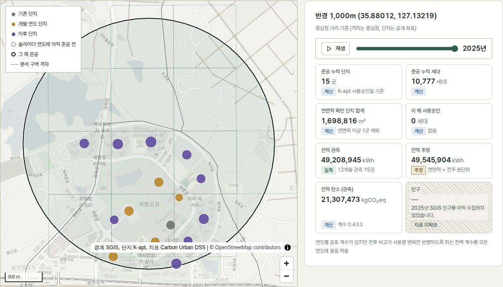

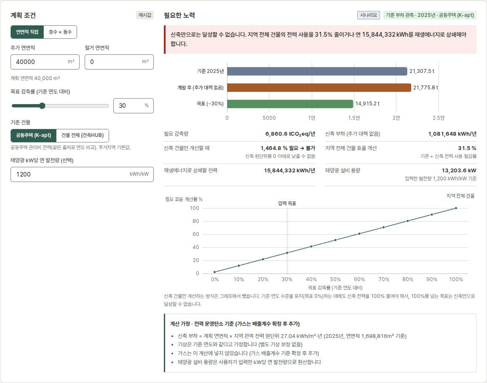

### 5.5 J06·J07 · 3D 계획안 A(일반)와 C(고효율 + 태양광)

**입력 순서 (J06 계획안 A)**

1. 범위: `전주시`, 2025년. 지도 분석에서 격자 `cell_966500_1764500`(에코시티)를 선택하거나 사례 링크로 엽니다.
2. 메뉴 **시뮬레이션** → 3D 패널 **대지 옮기기** → 지도에서 3종일반주거 부지(위도 35.880124, 경도 127.13219) 클릭.
3. 개발 조건: 대지면적 `40000`, 건물 수 `10`, 동별 건축면적 `600`, 층수 `15`, 세대수 `1000`, 계획 인구 `2500`, 평균 세대면적 `84`, 효율 계수 `1`, 태양광 `0`, 녹지 `0.3`.
4. **시나리오 계산** → **보고서용 장면 저장**.

사례 링크(A): `http://localhost:5173/simulation?region=52110&grid=cell_966500_1764500&year=2025&site=127.132190,35.880124,0&site_area=40000&building_count=10&footprint_per_building=600&floors=15&households=1000&population=2500&efficiency_factor=1&pv_ratio=0&green_ratio=0.3&average_household_area=84&min_households=900&min_population=2200`
계획안 C(J07)는 같은 링크에서 `efficiency_factor=0.8&pv_ratio=0.15`.

| 항목 | A 일반 (J06) | C 고효율 0.8 + 태양광 15% (J07) |
|---|---:|---:|
| 연면적 · 용적률 · 건폐율 | 90,000 m² · 225% · 15% | 같음 |
| 연간 전력 | 3,320,137.9 kWh | 2,257,693.7 kWh |
| 연간 가스 | 4,339,656.2 kWh | 3,471,725.0 kWh |
| **연간 전체 탄소(전력+가스)** | **2,230,040.9 kg (2,230.0 t)** | **1,611,518.4 kg (1,611.5 t), A 대비 −27.7%** |
| 1인당 탄소 | 892.0 kg | 644.6 kg |
| 전력 최대 달 | 8월 | 8월 |
| 대지 용도지역 | 제3종일반주거 99.85%, 준주거 0.15% | 같음 |
| 조례 상한 | 건폐율 50.02% · 용적률 300.31% → **이내** (지구단위계획구역 100%: 지구단위계획 우선) | 같음 |
| 현재(격자 관측 기준값) | 10,321,305 kg | 같음 |

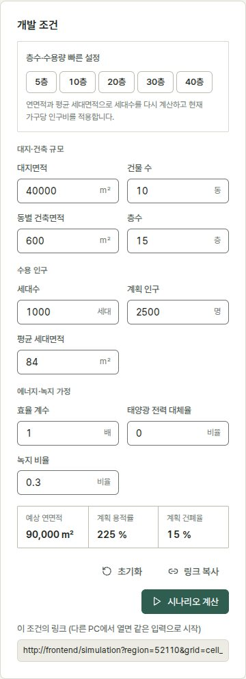

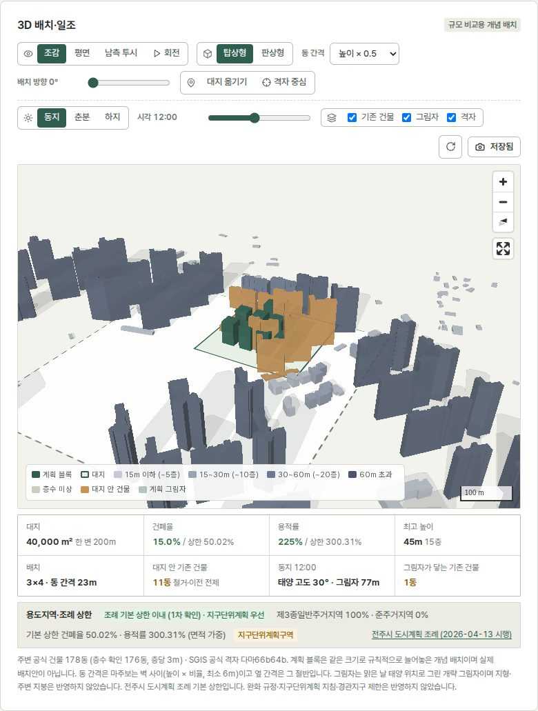

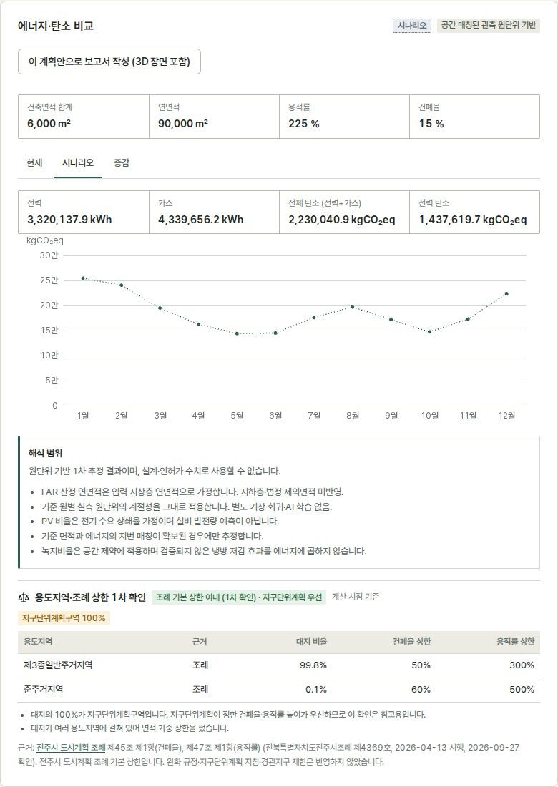

**해석**: "현재"는 이 격자에서 12개월 관측된 공동주택 지번 전체의 합계(기준값)이고, 계획안 값은 계획 연면적 × 관측 원단위입니다. 두 값의 차이는 "감축"이 아니라 규모 차이이므로, **계획안끼리(A ↔ C) 비교**합니다.

### 5.6 J08 · 대지 위치에 따라 상한이 달라짐

J06과 입력이 같고 **대지를 옮기지 않은 경우**(격자 중심) 대지의 65.81%가 자연녹지지역이라 면적 가중 상한이 용적률 168.38% · 건폐율 30.26%로 낮아지고, 계획 용적률 225%는 **조례 기본 상한 초과**로 나옵니다. 탄소 값은 같습니다(대지 위치는 법적 상한에만 영향).
링크: J06 링크에서 `site=…&` 부분을 뺍니다.

### 5.7 J09 · 최적안 탐색 (개발지)

J06 화면(계획안 A 입력 그대로: 효율 1.0, 태양광 0) 아래 **도시구조 최적화**: 최소 세대수 `900`, 최소 인구 `2200` → **최적안 탐색**.

| 후보 | 층수 × 동수 | 세대 | 용적률 | 연간 전체 탄소 |
|---|---|---:|---:|---:|
| 탄소 최소 | 21층 × 6동 | 900 | 189.0% | 1,873,234 kgCO2eq |
| 세대당 탄소 최소 | 21층 × 6동 (같은 후보) | 900 | 189.0% | 1,873,234 kgCO2eq |
| 20% 범위 내 수용량 최대 | 30층 × 5동 | 1,071 | 225.0% | 2,230,041 kgCO2eq |

1,748개 조합 중 165개가 조례 상한(건폐율 50.02%·용적률 300.31%)과 수용 조건을 만족했습니다.

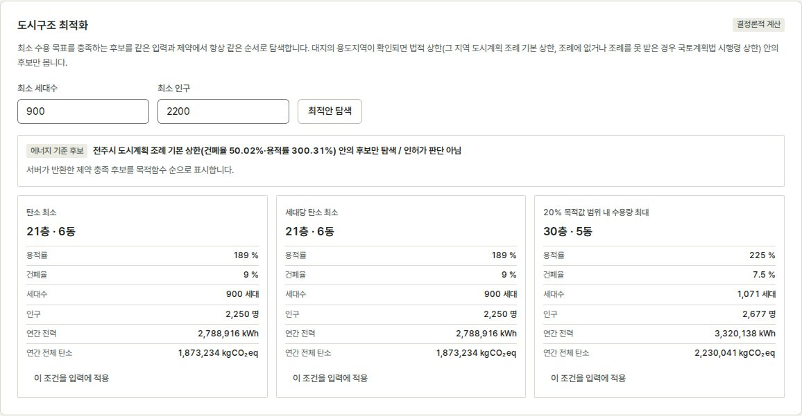

### 5.8 J10·J11 · 상업지 주상복합 (서부신시가지)

입력: 격자 `cell_964500_1757500`, 대지 위치 (위도 35.815588, 경도 127.109795), 대지 `10000`, 2동 × 25층, 동별 `1500` m², 600세대, 1,500명, 녹지 0.2.
링크: `http://localhost:5173/simulation?region=52110&grid=cell_964500_1757500&year=2025&site=127.109795,35.815588,0&site_area=10000&building_count=2&footprint_per_building=1500&floors=25&households=600&population=1500&efficiency_factor=1&pv_ratio=0&green_ratio=0.2&average_household_area=84&min_households=500&min_population=1200`

| 항목 | 값 |
|---|---|
| 연면적 · 용적률 · 건폐율 | 75,000 m² · **750%** · 30% |
| 연간 전력 · 가스 | 3,391,785.6 kWh · 3,715,872.9 kWh |
| 연간 전체 탄소 | 2,147,161.6 kg |
| 용도지역 | 중심상업지역 100% → 조례 상한 용적률 **700%** · 건폐율 80% → **초과** (지구단위계획구역) |
| 최적안 (J11, 500세대·1,200명 이상, 효율 1.0) | 190개 중 38개가 상한(700%) 안. 탄소 최소 28층 × 1동 500세대 용적률 420% 1,202,410 kgCO2eq · 수용량 최대 33층 × 1동 589세대 495% 1,417,127 kgCO2eq |

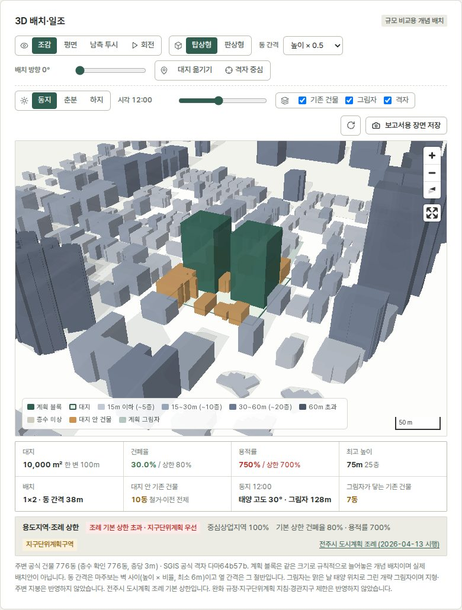

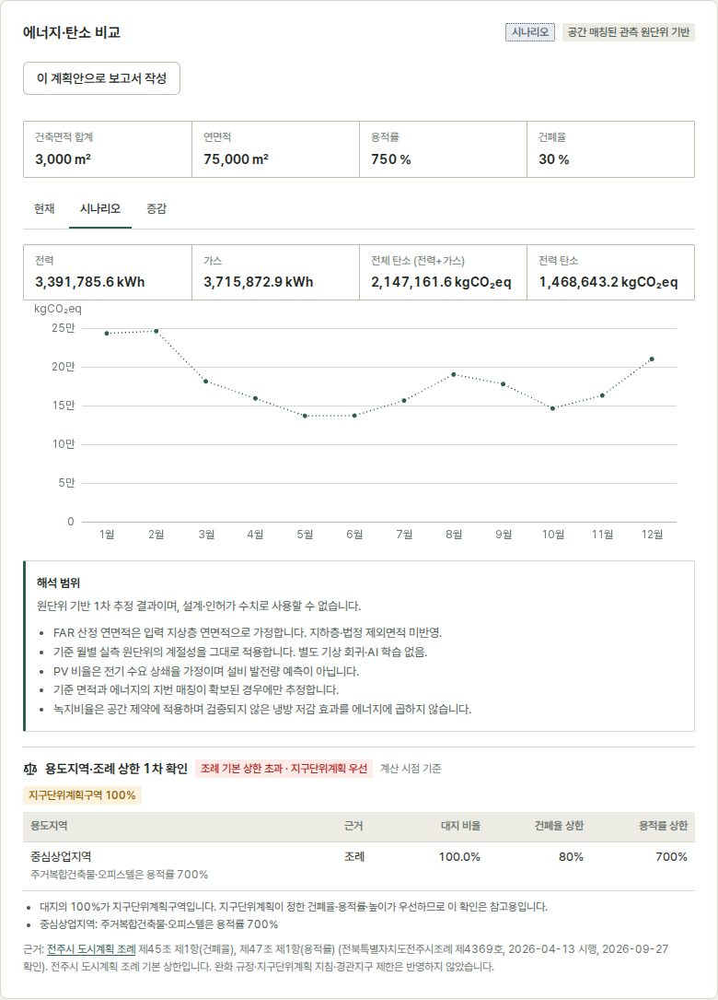

### 5.9 J12 · 법적 상한 1차 확인만 하기

대지 (127.13219, 35.880124), 4만 m², 회전 0°, 용적률 225% · 건폐율 15% · 1,000세대 →
용도지역 제3종일반주거 99.85% · 준주거 0.15%, 조례 상한 건폐율 50.02% · 용적률 300.31%, 지구단위계획구역 1곳, 판정 **"조례 기본 상한 이내 (1차 확인) · 지구단위계획 우선"**. 화면의 3D 패널은 계산 전에도 이 확인을 바로 보여 줍니다(API: `GET /api/zoning/site`).

### 5.10 J13 · 격자 보고서 (계획안 A·C 비교)

J07(C)을 먼저 계산·장면 저장 → J06(A)을 계산·장면 저장 → **이 계획안으로 보고서 작성** → 계획안 목록에서 C를 추가로 체크 → **보고서 작성**. 보고서의 "계획안 A·B"는 **고른 순서**를 뜻하므로 여기서는 A(일반)가 대안 1, C(고효율+태양광)가 대안 2(계획안 B 색)로 나옵니다.

| 보고서 항목 | 값 |
|---|---|
| 격자 현황 2025 (공동주택 관측 지번) | 전력 15,366,604 kWh · 가스 20,085,244 kWh · 운영탄소 10,321,305 kgCO2eq, 12/12개월 |
| 비교안 1 (A) | 15층 10동, 용적률 225.0%, 연간 2,230,040.9 kgCO2eq |
| 비교안 2 (C) | 같은 배치, 연간 1,611,518.4 kgCO2eq |
| 대상지 개요 문장 | 10개 (행정동·SGIS 1km·건물·K-apt·건축HUB·대장·모델 검증) |
| 유의사항 | 7개 |
| 장 구성 | 7장 (검토 요약 ~ 재현 정보) |

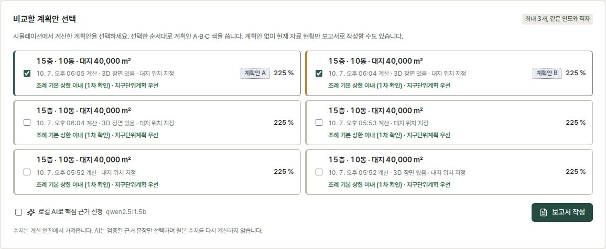

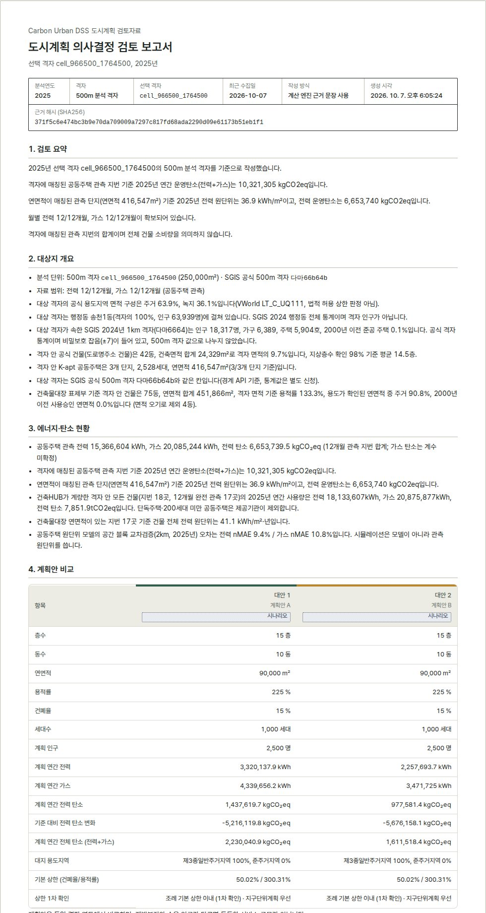

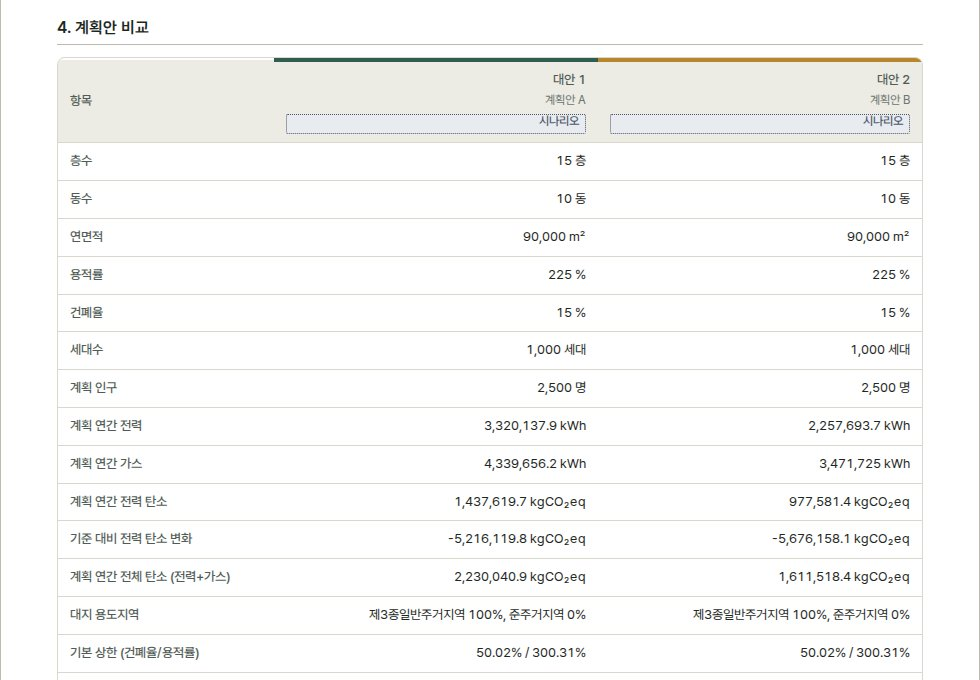

### 5.11 J14 · 지역 보고서

J01 화면 맨 아래 **보고서** → 제목(선택) → **현재 조건으로 보고서 작성**. "로컬 AI로 요약 문장 쓰기"를 켜면 로컬 모델이 문장을 쓰되, 숫자·연도·증감 방향이 근거와 하나라도 다르면 쓰지 않고 검증된 서식으로 바꿉니다. 보고서에는 근거 문장 23개, 표(연도별 관측, 건물 전체 에너지, SGIS 지역 특성), 감축 계산의 가정, 근거 SHA-256이 들어갑니다. **마크다운 내려받기**로 문서를 받습니다.

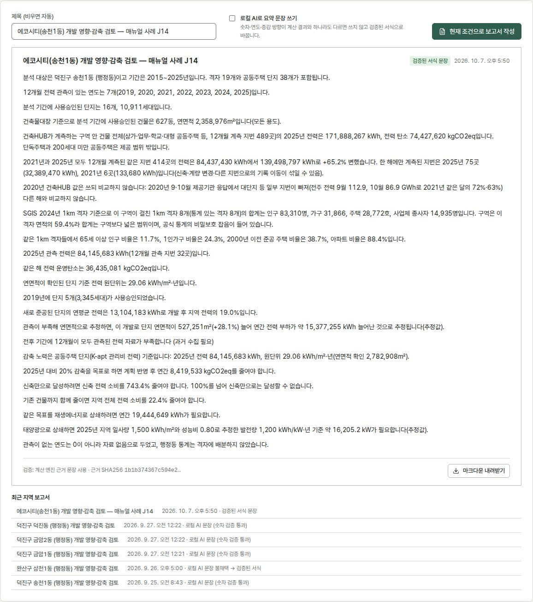

### 5.12 S01~S03 · 수원 (다른 지역에서 같은 절차)

범위를 `경기도` → `수원시`로 바꾸면 같은 화면이 수원 자료로 계산합니다.

| 사례 | 입력 | 결과 |
|---|---|---|
| S01 광교1동 (개발지) | +60,000 m², −20%, 공동주택 | 격자 32·단지 24, K-apt 2025 55,050,348 kWh, 기준 23,836.8 t, 필요 감축 **5,385.1 t**, 지역 효율 **22.0%**, 태양광 **10,571.8 kW** (ERA5 일사량 1,470 kWh/m² × 0.80 = 1,176.4 kWh/kW, 추정) |
| S02 인계동 (상업지) | +60,000 m², −20%, 건물 전체 | 격자 11·단지 20, 건축HUB 2025 234,250,661 kWh, 기준 101,430.5 t, 필요 감축 **22,275.9 t**, 지역 효율 **21.5%**, 태양광 **43,731.3 kW** |
| S03 기본 대상지 + J06 계획안 | 격자 `cell_950000_1919000`, 대지 격자 중심 | 연간 탄소 1,818,730.4 kg(전력 4,017,974.3 · 가스 432,352.1 kWh: 지역난방 단지가 많아 가스가 작음). 제3종일반주거 79.8%·자연녹지 19.1%·2종 1.1% → 수원시 조례 가중 상한 용적률 **205.11%** → 225%는 **초과** |

링크: S01 `…/area?region=41110&area=admin:31014620&from=2015&to=2025&window=3&plan=60000&target=20&basis=apartments`, S02 `…/area?region=41110&area=admin:31013560&…&plan=60000&target=20&basis=buildings`, S03 `…/simulation?region=41110&grid=cell_950000_1919000&year=2025&site_area=40000&building_count=10&footprint_per_building=600&floors=15&households=1000&population=2500&efficiency_factor=1&pv_ratio=0&green_ratio=0.3&average_household_area=84`

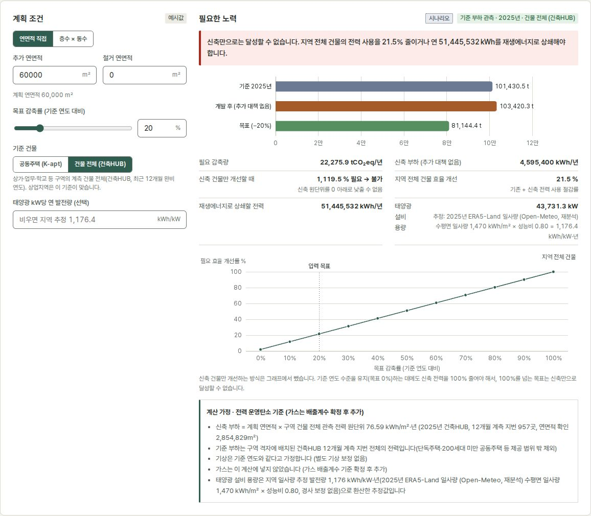

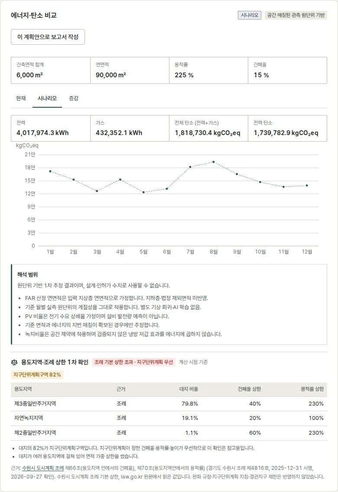

**해석**: 같은 계획안이 전주 3종일반주거 대지에서는 상한 이내, 수원 기본 대상지에서는 자연녹지가 섞여 상한 초과입니다. 지역을 바꾸면 **조례·용도지역·관측 원단위가 모두 그 지역 것으로** 바뀝니다.

### 5.13 G01·G02 · 서울 강동구

| 사례 | 입력 | 결과 |
|---|---|---|
| G01 고덕2동 (재건축 개발지) | +60,000 m², −20%, 공동주택 | 격자 10·단지 5, K-apt 2025 26,760,667 kWh, 기준 11,587.4 t, 필요 감축 **2,937.7 t**, 신축만 473.7%(불가), 지역 효율 **24.1%**, 태양광 **5,899.5 kW** (ERA5 1,438 kWh/m² → 1,150 kWh/kW). 개발 연도 2019(추정 증가 22,691,635 kWh/년) |
| G02 천호3동 (상업지역 격자가 있는 상업지) | +40,000 m², −20%, 건물 전체 | 격자 4·단지 13, 건축HUB 2025 107,072,181 kWh(12개월 계측 지번 470곳, 원단위 78.40 kWh/m²), 기준 46,362.3 t, 필요 감축 **10,630.3 t**, 신축만 782.9%(불가), 지역 효율 **22.3%**, 태양광 **21,348.2 kW** |

강동구는 2026-10-08에 준비해 2025년 자료만 있습니다. 2020~2024 건축HUB와 과거 K-apt가 들어오면 개발 전후 관측 비교가 가능해지고, 그때 사례 값도 다시 기록합니다(9.4절).

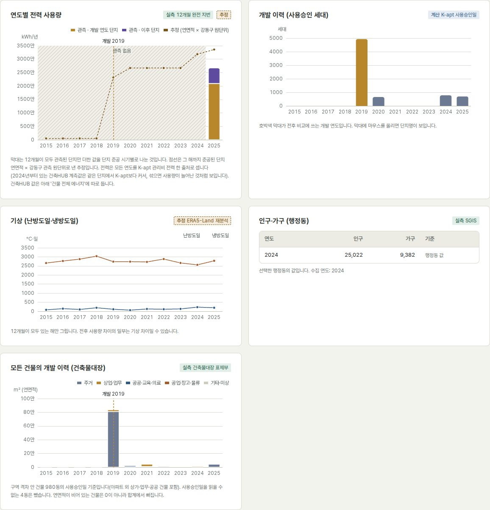

### 5.14 B01·B02 · 부산 강서구

| 사례 | 입력 | 결과 |
|---|---|---|
| B01 명지1동 (명지국제신도시 개발지) | 행정동 `21120590`, +60,000 m², −20%, 공동주택 | 격자 49·단지 20 (2015~2021 사용승인 17,059세대), K-apt 2025 62,822,983 kWh, 원단위 27.54 kWh/m², 기준 27,202.4 t, 필요 감축 **6,155.9 t**, 지역 효율 **22.1%**, 태양광 **10,986.7 kW** (ERA5 1,618 kWh/m² × 0.80 = 1,294 kWh/kW, 추정) |
| B02 명지1동 상업 중심 격자 | 격자 `cell_1128000_1678500`, +30,000 m², −20%, 건물 전체 | 건축HUB 2025 24,162,764 kWh(지번 14곳, 원단위 49.07 kWh/m²), K-apt 6,579,257 kWh, 기준 10,462.5 t, 필요 감축 **2,729.9 t**, 지역 효율 **24.6%**, 태양광 **4,872.2 kW** |

링크: B01 `…/area?region=26440&area=admin:21120590&from=2015&to=2025&window=3&plan=60000&target=20&basis=apartments`, B02 `…/area?region=26440&area=grid:cell_1128000_1678500&from=2015&to=2025&window=3&plan=30000&target=20&basis=buildings`

> 부산 강서는 2026-10-08 준비가 끝났지만 격자의 주된 용도지역이 대부분 "기타"로 분류되어 용도지역으로 상업지를 고를 수 없습니다(원인 확인 필요: 표본 격자에서 세부 구분이 없는 "도시지역" 도형이 보임). 그래서 B02는 명지1동에서 **건물 전체 전력 − 공동주택 전력이 가장 큰 격자**로 골랐습니다. 이 분류 문제는 팀원 과제(T3)로 점검합니다.

---

## 6. 결과 읽는 법

| 표시 | 뜻 | 주의 |
|---|---|---|
| 신축만 개선 "743.4% → 불가" | 새 건물 전력을 100% 넘게 줄여야 함 = 신축만으로는 목표 불가 | 기존 건물까지 포함한 "지역 전체 효율"을 봄 |
| 지역 전체 효율 22.4% | 기존 + 신축 건물 전력을 모두 그만큼 줄이면 목표 달성 | 기상은 기준 연도와 같다고 가정 |
| 태양광 kW (추정) | 필요한 상쇄 kWh ÷ 지역 발전량(일사량 × 0.80) | 경사 보정·그늘·설치 면적 미반영. 사용자 값이 있으면 그 값 |
| 현재 vs 시나리오 (3D) | 격자 관측 합계 vs 계획 연면적 × 원단위 | 차이는 감축이 아님. 계획안끼리 비교 |
| 지역 평균 기준 (BAU) | 격자에 관측이 없어 지역 평균 원단위로 추정 | "추정" 배지 |
| 조례 상한 이내/초과 | 대지 용도지역 면적 가중 상한과 계획 비교 | 지구단위계획·완화 규정 우선, 인허가 판단 아님 |
| 자료 없음, 빗금 | 관측 없음(0 아님) | 빠진 자료는 수집 데이터에서 채움 |
| 2020년 "일부 결측·비교 제외" | 제공기관 9·10월 일부 지번 누락 | 다른 해와 비교하지 않음 |

---

## 7. 보고서

1. **숫자의 출처**: 모든 숫자는 계산 엔진이 만든 근거 문장에서만 옵니다. 로컬 AI(Ollama `carbon-area-narrator-v2`)는 문장을 다듬을 뿐이고, 검증기가 숫자·연도·증감 방향·감축 기준을 대조해 하나라도 다르면 AI 문장을 버리고 검증된 서식으로 씁니다.
2. **재현 정보**: 보고서 ID와 근거 SHA-256이 끝에 들어갑니다. 같은 자료·같은 입력이면 근거 문장이 같습니다(AI 문장은 PC 성능에 따라 표현이 다를 수 있으나 숫자는 같음).
3. **기준 표기**: 감축량 문장에는 기준 건물(공동주택 K-apt / 건물 전체 건축HUB)과 기준 연도가 함께 들어갑니다.
4. **보관**: 보고서는 DB에 저장되고(작성 이력), 마크다운·인쇄(PDF)로 내보냅니다. 이후 자료가 바뀌어도 저장된 보고서는 바뀌지 않습니다.

---

## 8. 자료를 더 모으기

| 하려는 일 | 방법 |
|---|---|
| 빠진 연도·자료를 한 번에 | 앱 **수집 데이터 → 빠진 자료 전부 수집**, 또는 `scripts\dss.cmd CollectHistory -FromYear 2015 -ToYear 2025` |
| 새 지역 상세 준비 | **전국 지역**에서 시·군·구 선택 → 상세 자료 수집 (격자 → 행정동 → 기상·조례 → 단지 → 용도지역·건물·지적 → 대장 → 건축HUB → K-apt) |
| 준비한 지역의 과거 건축HUB | `docker compose … exec -T api python -m app.cli region-energy-history --region 11740 --years 2024,2023,2022,2021,2020` |
| 일사량(태양광 추정) | `… python -m app.cli backfill-solar` |
| 받은 파일 넣기 | `data/raw/<출처>/`에 원본 그대로 두고 수집 데이터 → 파일 올리기 |
| 끝난 뒤 점검 | `… python -m app.cli check-standard` |

자료를 모으기 전에 **[공통 데이터 기준](DATA_STANDARD.md) 0절**을 매번 확인합니다. 공공데이터포털은 서비스마다 하루 한도가 있어(K-apt 5,000건, 건축HUB 10,000건) 한도에 걸리면 다음 날 00:20에 이어 받습니다.

---

## 9. 다른 PC에서 같은 결과 확인하기

### 9.1 원리

같은 결과가 나오려면 **같은 코드 + 같은 자료 + 같은 입력**이어야 합니다.

| 같아야 하는 것 | 맞추는 방법 |
|---|---|
| 코드 | GitHub `main`의 같은 커밋 (`git log -1`) |
| 자료 | 같은 자료 묶음(`ExportBundle` → `ImportBundle`/`MergeBundle`) |
| 입력 | 사례 파일(`backend/cases/simulation_cases.json`)·사례 링크 |

### 9.2 사례 검증 명령 (`verify-cases`)

```powershell
# 기본 사례 파일(저장소의 backend/cases/simulation_cases.json)과 비교
scripts\dss.cmd VerifyCases
# 받은 자료 묶음에 들어 있던 사례 파일과 비교
scripts\dss.cmd VerifyCases -CasesPath D:\share\simulation_cases.json
# 직접 실행
docker compose -p carbon-urban-dss -f compose.yaml -f compose.demo.yaml exec -T api python -m app.cli verify-cases
```

출력 예:

```
[일치] D01 전주시 자료 지문 (계산이 읽는 행 수·합계) — 값 25개
[일치] J01 전주 개발지 · 송천1동(에코시티) 개발 전후와 감축 20% (공동주택 기준) — 값 54개, 근거 문장 23개
...
결과: 25개 사례 모두 일치 — 이 PC의 계산 결과는 기준 PC(2026-10-08T…)와 같습니다.
```

- 계산은 **읽기만** 합니다. 계획안·보고서를 DB에 저장하지 않습니다(격자 보고서의 계획안은 계산 중에만 쓰고 되돌림).
- 숫자는 상대 오차 100만분의 1(최소 0.01) 안이면 같다고 봅니다. 근거 문장은 글자 하나까지 같아야 합니다.
- **자료 지문(D01~D04)이 다르면** 계산이 아니라 DB 자료가 다른 것입니다. 같은 날짜의 자료 묶음을 가져왔는지 확인합니다.
- 결과 전체는 `--out` 파일(JSON)에 남습니다(`scripts\dss.cmd VerifyCases`는 `data\ops\<시각>-verifycases\cases-check.json`).

### 9.3 사례 링크

지역 시뮬레이션·시뮬레이션의 **링크 복사**는 지역·구역·격자·대지 위치·입력값을 주소에 담습니다. 받은 사람이 열면 같은 입력으로 시작하고, 같은 자료 묶음이면 같은 숫자가 나옵니다. 직접 그린 구역은 링크로 옮길 수 없습니다.

### 9.4 기준값을 새로 기록할 때 (자료를 가진 PC)

자료가 바뀌면(새 연도 수집, 지역 준비) 사례 값도 바뀝니다. 자료 묶음을 만들 때 `ExportBundle`이 **같은 DB 상태에서** 사례를 다시 계산해 묶음 안 `simulation_cases.json`에 기록하므로, 묶음과 기준값은 항상 짝이 맞습니다. 저장소의 사례 파일을 갱신하려면:

```powershell
docker compose -p carbon-urban-dss -f compose.yaml -f compose.demo.yaml exec -T api python -m app.cli verify-cases --record /data/ops/simulation_cases.json --note "자료 묶음 이름"
# data\ops\simulation_cases.json을 backend\cases\simulation_cases.json으로 옮겨 커밋
```

### 9.5 새 PC 모의 점검 (`VerifyBundle`)

```powershell
scripts\dss.cmd VerifyBundle -OutDir F:\carbon-dss-bundles
```

묶음 내보내기 → 현재 커밋을 깨끗한 폴더에 `git clone` → 그 폴더의 실행기로 **별도 프로젝트**(`carbon-urban-dss-importtest`, 포트 8010/5190)에 `ImportBundle` → 행 수·화면 확인 → **사례 25개 재계산·비교** → 별도 프로젝트 정리. `-OutDir`을 주면 묶음과 복제 폴더를 그 드라이브에 만들고 끝나면 복제 폴더를 지웁니다(C 드라이브 공간이 부족할 때).

---

## 10. 문제 해결

| 증상 | 조치 |
|---|---|
| 화면이 열리지 않음 | Docker Desktop 실행 확인 → `docker compose … up -d` → 1~2분 뒤 `http://localhost:5173` |
| "자료 없음"과 빗금이 많음 | 아직 수집하지 않았거나 제공기관이 공표하지 않은 값. 수집 데이터 → 빠진 자료 전부 수집 |
| 처음 고른 시·군·구가 바로 안 열림 | 전국 공통 자료로 기본 지도를 만드는 중(몇 초). 전국 지도는 처음 15~25초 |
| "한도 초과 — 자동 재개 대기" | 정상. 다음 날 00:20에 이어 받음(PC·Docker가 켜져 있어야 함) |
| 지역 시뮬레이션 첫 계산이 느림 | 그 지역·기간 자료를 처음 읽는 중(10~20초). 이후 몇 분 동안은 바로 계산 |
| 3D가 회색이거나 안 보임 | 브라우저 하드웨어 가속(WebGL) 켜기. 원격 데스크톱에서는 느릴 수 있음 |
| `verify-cases`에서 자료 지문이 다름 | 다른 날짜의 자료 묶음. 기준 PC의 최신 묶음을 다시 받거나, 묶음 안의 `simulation_cases.json`으로 비교 |
| `verify-cases`에서 값만 다름(자료 지문은 같음) | 코드 판이 다를 수 있음: `git pull` → `scripts\dss.cmd Rebuild` 후 다시 실행. 그래도 다르면 `cases-check.json`을 팀에 공유 |
| `ImportBundle`이 "already has N tables"로 중단 | 대상 DB가 비어 있지 않음. 팀원 자료를 더하려면 `MergeBundle` |
| `환경변수 형식 오류` | `.env` 값이 예시 문구·한글·따옴표 포함. 실제 키로 바꾸고 api·worker 재생성 |

더 많은 항목: [팀원 PC 재현 4절](TEAM_SETUP.md#4-문제-해결), [사용 방법 13절](USAGE.md#13-문제-해결).

---

## 11. 한계와 주의

- 건축HUB는 단독주택·200세대 미만 공동주택을 제공하지 않아 지역 총량보다 작습니다(탄소공간지도 대비 칸별 비율 중앙값 0.67~0.76). 총량은 한전 시군구 전력·지역 인벤토리와 맞대어 봅니다.
- 가스 탄소는 가정 계수(0.1826)이고, 감축 노력 계산은 전력 기준입니다.
- 3D 배치는 규모 비교용 개념 배치이며, 일조·그림자는 맑은 날 태양 위치로 그린 개략도입니다.
- 법적 상한은 조례 기본 상한(없으면 시행령)이며 지구단위계획·완화 규정·경관지구 제한을 반영하지 않습니다.
- 개발 전후 비교는 관측이 있는 연도만 쓰고, 부족하면 연면적 × 원단위 추정으로 보완하며 "추정값"으로 표시합니다.
- 자세한 목록: [LIMITATIONS.md](LIMITATIONS.md).

---

## 부록 A. 계산식 요약

| 계산 | 식 |
|---|---|
| 지번 연간 에너지 | 12개월 모두 관측된 지번만 Σ 월 사용량 |
| 원단위 | I = E ÷ 같은 지번 건축물대장 연면적 (kWh/m²·년) |
| 전력 탄소 | C = E × F(y) (그해 말까지 공표된 최신 GIR 승인 계수) |
| 계획안 (3D) | 월별 계획 에너지 = 기준 격자 월별 원단위 × 계획 연면적 × 효율 계수, 전력은 × (1 − 태양광 대체율) |
| 개발 후(BAU) | E_bau = E_기준 + I × (추가 − 철거 연면적) |
| 필요 감축량 | ΔC = E_bau × F − E_기준 × F × (1 − 목표%) |
| 지역 전체 효율 | ΔC ÷ C_bau × 100 |
| 신축만 효율 | ΔC ÷ (I × 추가 연면적 × F) × 100 |
| 태양광 kW | ΔC ÷ F ÷ (일사량 kWh/m² × 0.80) |
| 개발 전후 | 개발 연도 앞 w년 평균 vs 뒤 w년 평균 (개발 연도 제외) |

전체 식과 기준: [공통 데이터 기준 5절](DATA_STANDARD.md#5-계산-공식).

## 부록 B. 용어

| 용어 | 뜻 |
|---|---|
| 500m 격자 | EPSG:5179 좌표 500m 정사각형 칸, ID `cell_<왼쪽아래 x>_<y>` |
| 건축HUB | 국토교통부 건물에너지(지번 × 월 전력·가스) |
| K-apt | 공동주택관리정보시스템(단지 × 월 관리비 에너지) |
| 기준 건물 | 감축 계산의 기준 부하 범위: 공동주택(K-apt) / 건물 전체(건축HUB) |
| BAU | 추가 대책 없이 계획만 반영한 상태 |
| 사례 링크 | 화면 입력을 담은 주소 |
| 자료 지문 | 계산이 읽는 행 수·합계(같은 자료인지 확인용) |
| 근거 문장 | 계산 엔진이 숫자와 함께 만든 문장, 보고서 숫자의 유일한 출처 |

## 부록 C. 명령어 모음

| 명령 | 용도 |
|---|---|
| `scripts\dss.cmd Doctor` | 사전 점검 |
| `scripts\dss.cmd ImportBundle -BundlePath <zip>` | 새 PC에 자료 묶음 넣기(+사례 검증) |
| `scripts\dss.cmd MergeBundle -BundlePath <zip> -DryRun` | 팀원 묶음 더하기 전 세기 |
| `scripts\dss.cmd ExportBundle [-OutDir <폴더>]` | 자료 묶음 만들기(+사례 기록) |
| `scripts\dss.cmd VerifyCases [-CasesPath <json>]` | 사례 재계산·비교 |
| `scripts\dss.cmd VerifyBundle [-OutDir <폴더>]` | 새 PC 모의 점검 |
| `scripts\dss.cmd CollectHistory` | 빠진 과거 자료 수집 |
| `… python -m app.cli check-standard` | 데이터 기준 점검 |
| `… python -m app.cli verify-cases [--only J01,J06] [--out <json>]` | 사례 재계산·비교 |

`…` = `docker compose -p carbon-urban-dss -f compose.yaml -f compose.demo.yaml exec -T api`

## 부록 D. 사례 입력값

사례 25개의 입력 전체와 기준 PC 값·근거 문장은 [`backend/cases/simulation_cases.json`](../backend/cases/simulation_cases.json)에 있습니다. 각 사례의 `input`은 화면이 API로 보내는 값과 같습니다(지역 시뮬레이션: `POST /api/areas/analyze`, 시뮬레이션: `POST /api/scenarios`, 최적안: `POST /api/optimize`, 법적 상한: `GET /api/zoning/site`).
